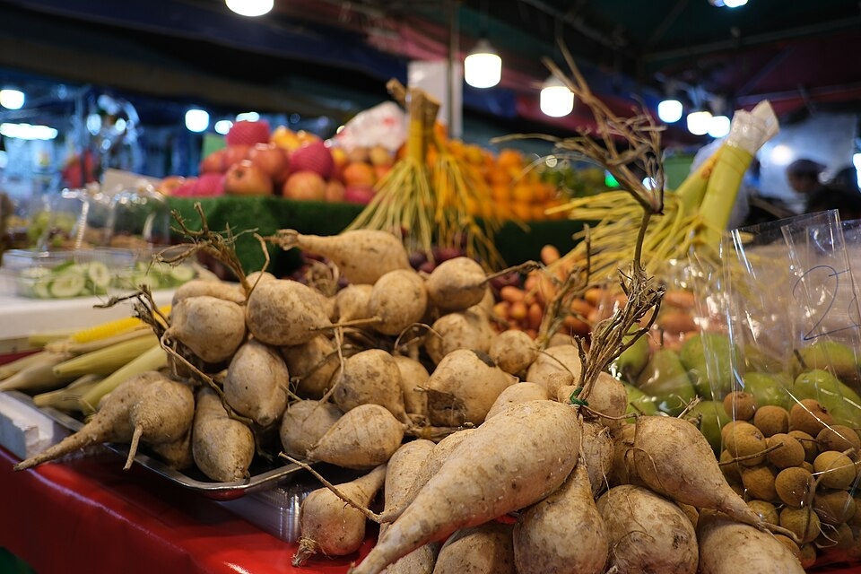
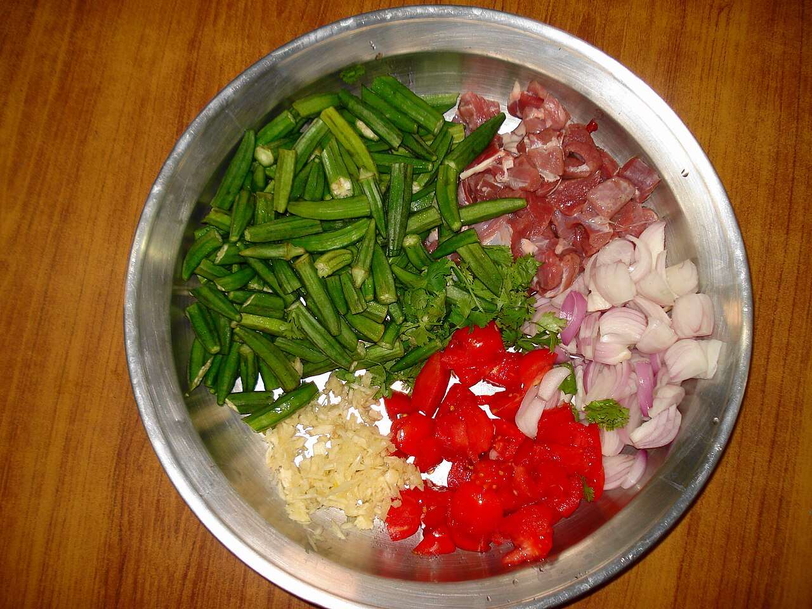
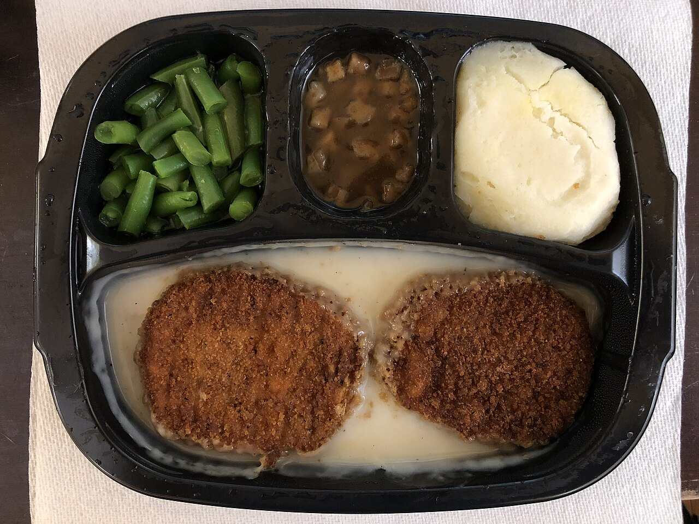
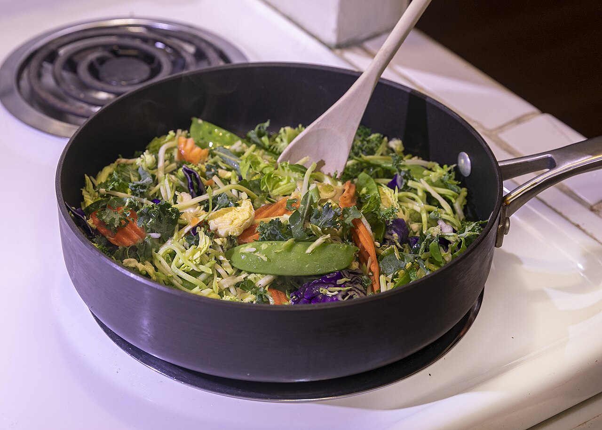

{/* _class: impact */}

# Why prepare at all

SLOP1640 — week 1

Marisol Quaye

---

## The thesis

A meal is decided before it is cooked. Selection, storage, temperature,
cutting and sequence determine the outcome; the stove only reveals it.

---

## What this course is not

- not a course about cooking faster
- not a course about life hacks
- time is a constraint this course keeps returning to, not the subject

---

## The shape of the argument

- weeks 1–10: the decision, taken apart step by step
- weeks 11–12: cook — and cook only to test whether the decision held
- if the thesis is right, identical cooking on differently prepared
  material should produce different results

---

{/* _class: banner */}

# Time, measured

---

## The headline figure

The US Bureau of Labor Statistics' American Time Use Survey, 2014 Eating
and Health Module: average daily time on food preparation, serving and
cleanup across Americans aged 18 and over.

**37 minutes a day.**

- reported by USDA's Economic Research Service
- not a trivial slice of a day already accounted for elsewhere

---

## The trend, not just the level

A separate USDA ERS analysis tracked the narrower activity of preparation
alone, over a decade:

| Period | Minutes/day preparing | Share who prepared that day |
|---|---|---|
| 2004–07 | 23.4 | 47% |
| 2014–17 | 27.5 | 54% |

An 18 percent increase in minutes, and a rising share of people doing any
preparation at all. Feeding oneself is not a shrinking task.

---

## Time and diet quality

Monsivais, Aggarwal & Drewnowski (2014) surveyed 1,319 adults and grouped
them by daily time on food preparation and cleanup:

- under one hour
- one to two hours
- over two hours

---

## What the groups reported

- more time preparing tracked with more fruit and vegetables reported
- the least-time group reported more convenience food and more eating out
- the study does not show time *causes* the difference — it shows an
  association this course treats as worth taking seriously

---

## What this course does not claim

A defensible source for the cost difference between eating out and
preparing at home did not turn up anything better than marketing copy.

- the claim is dropped rather than sourced to a listicle
- the time figures above stand on their own; money does not need to
  carry the argument

---

{/* _class: banner */}

# The cost of eating well

---

## The cost is real

Healthy food takes more time to produce than convenience food. That is not
a myth to be argued away — cutting, storing and choosing ingredients well
takes minutes that a packet does not ask for.

Okra, meat, shallots, tomato, garlic and coriander, cut and separated. None
of it has met heat. The meal is already decided.

---

## Where the time goes instead

This course does not pretend the time cost isn't there. It spends ten weeks
on exactly that cost: how to spend it once, before the stove, rather than
paying it badly every night under pressure.

- a vegetable stored badly cannot be rescued by a fast pan
- a cut made unevenly cooks unevenly, however quickly it is cooked
- a decision postponed to the stove is a decision made under time
  pressure, which is where most of it goes wrong

---

## What happens when the time isn't spent

Parents in Norway, surveyed by Djupegot et al. (2017). Odds of relying on
convenience food, against the low-time-scarcity group:

<svg viewBox="0 0 760 212" width="100%" xmlns="http://www.w3.org/2000/svg" role="img"
  aria-label="Bar chart: odds ratio of relying on convenience food rises with time scarcity. Low time scarcity is the reference at 1.0. Medium time scarcity is 2.6 times the odds of frequent fast-food intake. High time scarcity is 3.68 times the odds of high ultra-processed-dinner consumption.">
  <g fill="currentColor">
    <text x="0" y="26" font-size="15">Low time scarcity (reference)</text>
    <rect x="0" y="34" width="141" height="26" fill="#7d6230" />
    <text x="151" y="53" font-size="16" font-weight="600">1.0</text>

    <text x="0" y="100" font-size="15">Medium — frequent fast food</text>
    <rect x="0" y="108" width="367" height="26" fill="#b97d1c" />
    <text x="377" y="127" font-size="16" font-weight="600">2.6</text>

    <text x="0" y="174" font-size="15">High — heavy ultra-processed dinners</text>
    <rect x="0" y="182" width="520" height="26" fill="#e8ab3d" />
    <text x="530" y="201" font-size="16" font-weight="600">3.68</text>
  </g>
</svg>

Adjusted for gender, ethnicity, education, number of children and weight
status. Full citation in the reading list.

---

## What gets eaten instead

A heated tray: two breaded patties under gravy, cut green beans, mashed
potato. Roughly twelve minutes from freezer to table.

Every decision this course spends ten weeks on — selection, storage,
cutting, sequence — was made months earlier, in a factory, by someone
optimising for shelf life.

---

## The bet this course makes

The 10 weeks before the stove determine more of the outcome than the
time spent at the stove itself — and that is checkable, not asserted.

Weeks 11–12 check it directly: hold the cooking constant, vary only
what happened before.

---

{/* _class: banner */}

# The shape of the semester

---

## Ten weeks of preparation, by material

- weeks 2, 9: vegetables, then fruit — the ethylene chemistry links them
- weeks 3–4: animal protein, poultry and fish, then red meat
- week 5: aromatics and oil
- week 6: the tools that touch all of it

---

## The demonstrative week, and the synthesis

- week 7: the knife — demonstrated, not just argued
- week 8: a guest account of preparation under professional time pressure
- week 10: food safety and the cold chain — the synthesis before cooking
  starts

---

## Two weeks of proof

- week 11: identical dishes, differently prepared material
- week 12: an assessed live test — the thesis, checked against the plate

If the ten weeks of preparation were decorative, weeks 11–12 would not be
able to tell the difference. That they can is the point.

---

{/* _class: quote */}

> The claim this course is built on is not "spend more time." It is: the
> time that is spent decides the outcome long before heat is involved.
>
> — Marisol Quaye

---

{/* _class: centered */}

## Reading

- USDA ERS, ["Americans Spend an Average of 37 Minutes a Day Preparing and
  Serving Food and Cleaning
  Up"](https://www.ers.usda.gov/amber-waves/2016/november/americans-spend-an-average-of-37-minutes-a-day-preparing-and-serving-food-and-cleaning-up)
- USDA ERS, ["More Americans Spend More Time in Food-Related Activities
  Than a Decade
  Ago"](https://www.ers.usda.gov/amber-waves/2020/april/more-americans-spend-more-time-in-food-related-activities-than-a-decade-ago)
- Monsivais, Aggarwal & Drewnowski, ["Time spent on home food preparation
  and indicators of healthy eating"](https://www.sciencedirect.com/science/article/pii/S0749379714004000),
  *American Journal of Preventive Medicine* (2014).
- Djupegot, Nenseth, Bere, Bjørnarå, Helland, Øverby, Torstveit & Stea,
  ["The association between time scarcity, sociodemographic correlates and
  consumption of ultra-processed foods among parents in
  Norway"](https://pmc.ncbi.nlm.nih.gov/articles/PMC5433068/),
  *BMC Public Health* 17:447 (2017).

Next: week 2 starts on the material itself — vegetables, and what storage
decides before any knife is involved.
