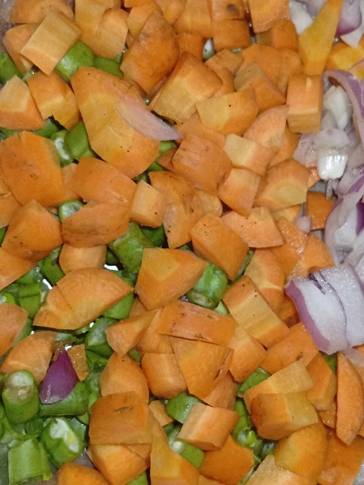

{/* _class: impact */}

# Vegetables

SLOP1640 — week 2

Marisol Quaye

---

## Where this week sits

A vegetable's life after purchase is mostly decided by where it goes
next, not by anything done to it at the stove. This week is entirely
inside the preparation-only remit of weeks 1 through 10.

- refrigerating something that does not tolerate cold — one common mistake
- leaving out something that spoils quickly at room temperature — the
  opposite mistake, equally common

---

{/* _class: banner */}

# Families, briefly

---

## Grouped by behaviour, not species

| Family | Examples |
|---|---|
| Roots and tubers | potato, carrot |
| Alliums | onion |
| Leafy greens | spinach, lettuce |
| Brassicas | broccoli, cauliflower, Brussels sprouts |

Storage behaviour tracks the family more reliably than it tracks any
single vegetable's popularity.

---

## What this week leaves out

Cuts are noted only as they affect keeping quality this week.

- the knife has its own week — week 7
- this lecture does not pre-empt it

---

{/* _class: banner */}

# Storage: shelf, drawer, cold or not

---

## Not refrigerated

Potatoes, sweet potatoes, whole winter squash and dry onions keep best
somewhere cool and dark.

- cold temperatures convert starch to sugar in a potato
- refrigeration **shortens** rather than extends its useful life

---

## Refrigerated

Leafy greens, most brassicas, carrots and herbs go into the refrigerator,
ideally in the crisper drawer.

- FDA: refrigerator at or below **4 °C (40 °F)**
- FDA: freezer at or below **−18 °C (0 °F)**
- checked with an appliance thermometer, not assumed from the dial setting

---

## Humidity setting

- **high humidity** (vent closed) — slows moisture loss, suits leafy
  greens
- **low humidity** (vent open) — lets moisture and ethylene escape, suits
  produce that would soften faster sealed and damp

University of Arkansas Cooperative Extension: leafy greens, broccoli and
asparagus belong in the high-humidity drawer.

---

{/* _class: banner */}

# Ethylene: producers and the sensitive

---

## What ethylene does

Ethylene is a plant hormone that accelerates ripening — and, past a
point, decay — in whatever produce sits near it.

---

## Producers versus sensitive

USDA Agricultural Marketing Service technical report on ethylene:

| Role | Produce |
|---|---|
| High producers | apples, bananas, avocados, pears, stone fruit, tomatoes |
| Sensitive | leafy greens, broccoli, carrots, cucumbers |

---

## Why the separation matters

Separating the two groups — different drawers, or at minimum not sealed
together in the same bag — is the single highest-value habit this week
teaches.

Week 9 returns to this same chemistry from the fruit side of the
exchange.

---

{/* _class: banner */}

# Choosing well at market

---

## Three checks before anything goes in a bag

- **firmness** — already soft is already declining
- **colour** — discoloured at cut edges is already declining
- **smell** — faintly fermented is already declining

Storage can only slow a decline that has already started; it cannot
reverse it.

---

{/* _class: banner */}

# Nutrition: common vegetables

---

## Fat, protein and calories per 100 g

Figures are for the raw vegetable, from USDA FoodData Central — the same
database the invent-a-recipe assessment names.

| Vegetable | Calories (kcal) | Fat (g) | Protein (g) | FDC ID |
|---|---|---|---|---|
| Onion, raw | 40 | 0.10 | 1.1 | 170000 |
| Carrot, raw | 41 | 0.24 | 0.93 | 170393 |
| Potato, raw, skin | 58 | 0.10 | 2.57 | 170032 |
| Spinach, raw | 23 | 0.39 | 2.86 | 168462 |

---

## What the numbers say

- none of the four is a meaningful source of fat
- calorie content tracks starch and water content, not protein or fat
- the tutorial's macro calculator uses exactly these four figures, scaled
  to whatever quantity a recipe calls for

---

{/* _class: quote */}

> Vegetables are frequently the largest component by weight in a
> prepared recipe, and the easiest to assume is nutritionally
> interchangeable. It is not.
>
> — Marisol Quaye

---

{/* _class: centered */}

## Reading

- [FDA — Are You Storing Food
  Safely?](https://www.fda.gov/consumers/consumer-updates/are-you-storing-food-safely)
- [FoodSafety.gov — Cold Food Storage
  Chart](https://www.foodsafety.gov/food-safety-charts/cold-food-storage-charts)
- [University of Arkansas Cooperative Extension Service — Spoiled
  Rotten](https://www.uaex.uada.edu/counties/miller/news/fcs/fruits-veggies/Spoiled-Rotten-How-to-Store-Fruits-and-Vegetables.aspx)
- [USDA AMS — Technical Report, Ethylene
  (Crops), 2023](https://www.ams.usda.gov/sites/default/files/media/EthyleneCropsTechnicalReport2023.pdf)
- [USDA FoodData Central](https://fdc.nal.usda.gov/)

Session 2's tutorial exercises the macro calculator on this week's four
vegetables. Next: week 3 moves to animal protein, starting with poultry
and fish.
