{/* _class: impact */}

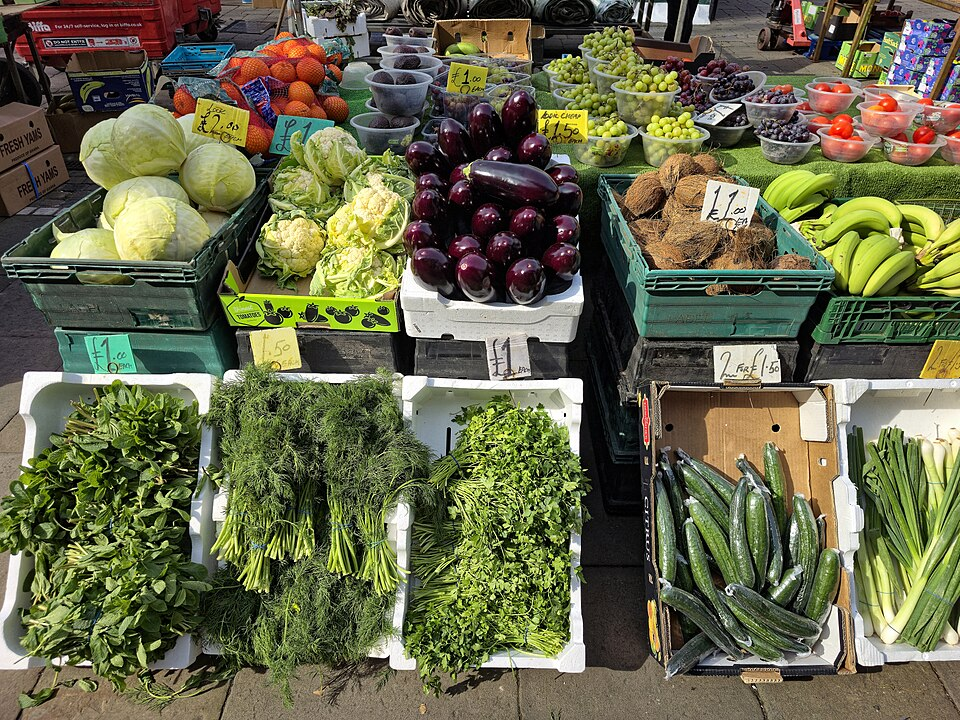

# Vegetables

SLOP1640 — week 2

Marisol Quaye

---

## Where this week sits

A vegetable's life after purchase is mostly decided by where it goes
next, not by anything done to it at the stove. This week is entirely
inside the preparation-only remit of weeks 1 through 10.

- refrigerating something that does not tolerate cold — one common mistake
- leaving out something that spoils quickly at room temperature — the
  opposite mistake, equally common

---

{/* _class: banner */}

# Families, briefly

---

## Grouped by behaviour, not species

| Family | Examples |
|---|---|
| Roots and tubers | potato, carrot |
| Alliums | onion |
| Leafy greens | spinach, lettuce |
| Brassicas | broccoli, cauliflower, Brussels sprouts |

Storage behaviour tracks the family more reliably than it tracks any
single vegetable's popularity.

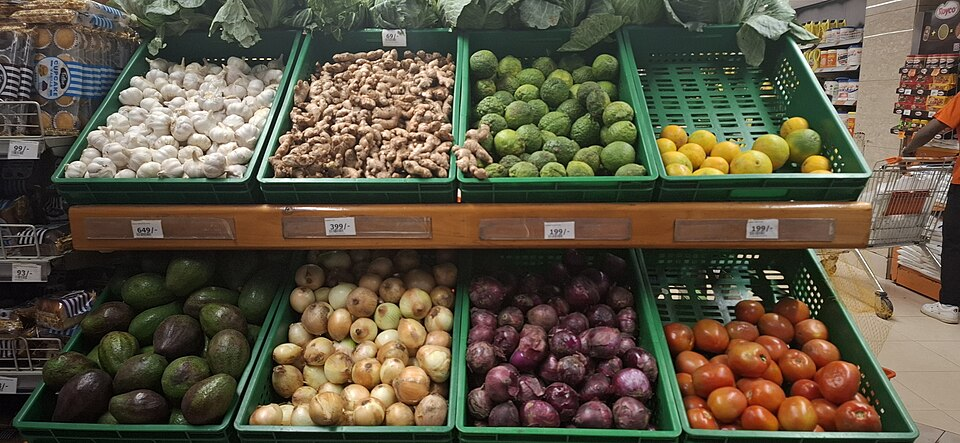

---

{/* _class: banner */}

# Cuts, and what they cost in storage life

---

## More surface, faster decline

A cut face is new surface that was, a moment before, sealed inside the
vegetable's skin. FDA guidance treats cut produce as more time-sensitive
than whole produce: refrigerate anything bought pre-cut, and cut away
any damaged or bruised area before use. More cut surface exposed per
gram means faster moisture loss and easier access for surface microbes —
this is reasoning from surface area, not a measured figure, and no
source is claimed for a specific spoilage rate.

- the shape does not change what a carrot is, only how much of it is
  exposed
- five shapes recur through a professional kitchen's prep: julienne,
  batonnet, brunoise, small dice, chiffonade

---

## Julienne

Carrot, julienne: about 3 mm × 3 mm, 65 mm long (1⁄8 in × 1⁄8 in ×
2½ in) — Auguste Escoffier School of Culinary Arts.

A thin matchstick puts a large share of the carrot's volume within a
cut face. Julienned vegetables are usually held briefly rather than
stored.

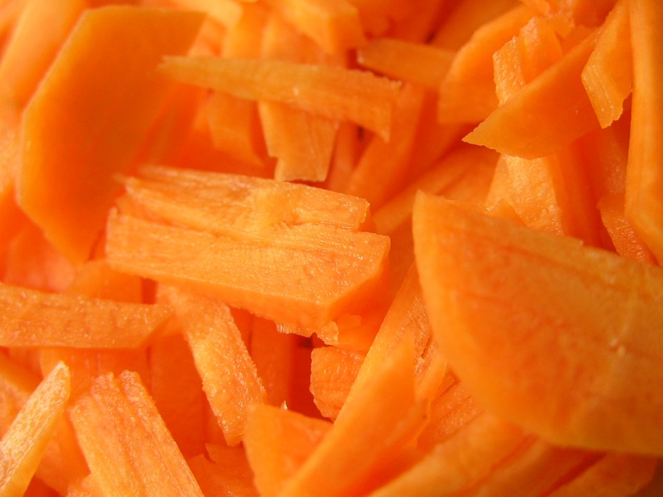

---

## Batonnet

Carrot, batonnet: about 6 mm × 6 mm, 65 mm long (1⁄4 in × 1⁄4 in ×
2½ in) — Auguste Escoffier School of Culinary Arts.

Twice the julienne's cross-section at the same length, so less of the
carrot sits within a millimetre of a cut face — the reason a batonnet
holds slightly longer under refrigeration.

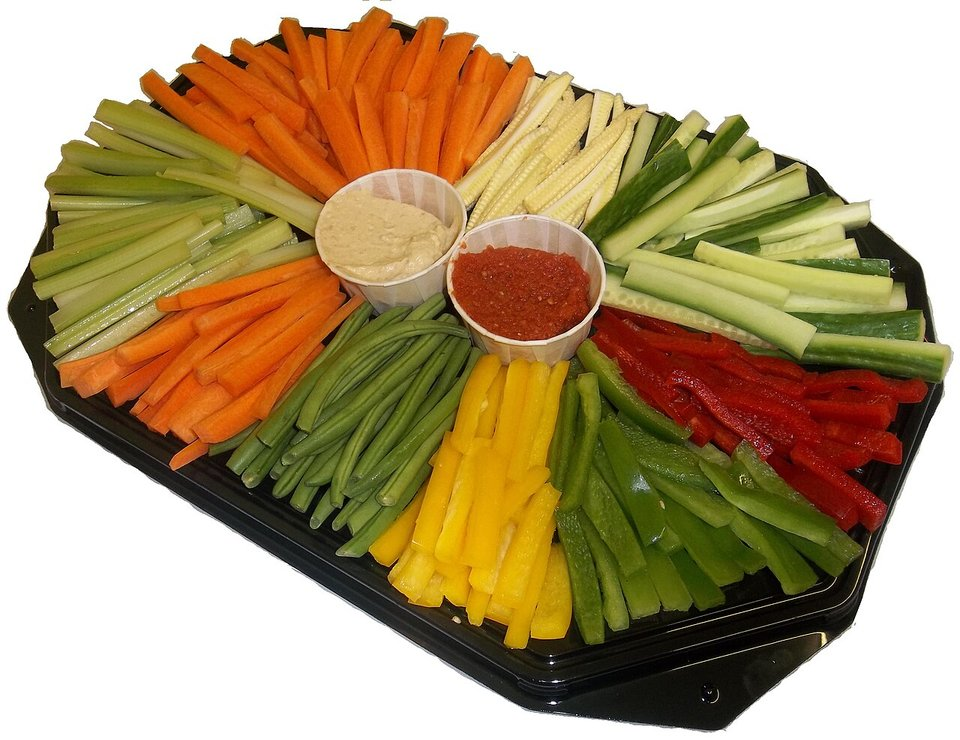

---

## Brunoise

Carrot, brunoise: about 3 mm cubes (1⁄8 in) — Auguste Escoffier School
of Culinary Arts.

A julienne cut again, crosswise, which roughly doubles the cut surface
for the same piece of carrot. Brunoise is usually cut for the same
session it is used in, not stored.

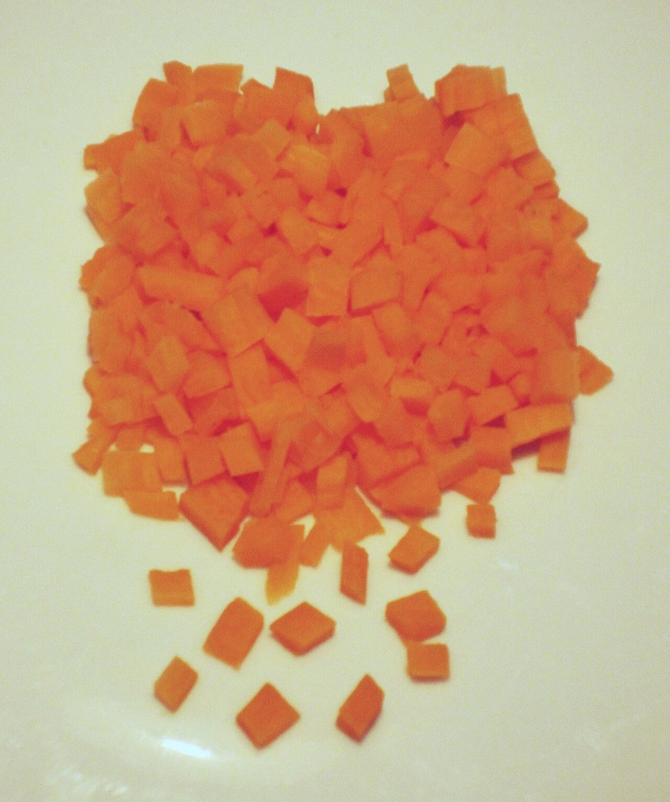

---

## Small dice

Carrot, small dice: about 6 mm cubes (1⁄4 in square) — Auguste
Escoffier School of Culinary Arts.

Doubling every side of a batonnet's cross-section into a cube roughly
doubles the cut surface again. Diced carrot is refrigerated the same
day it is cut.

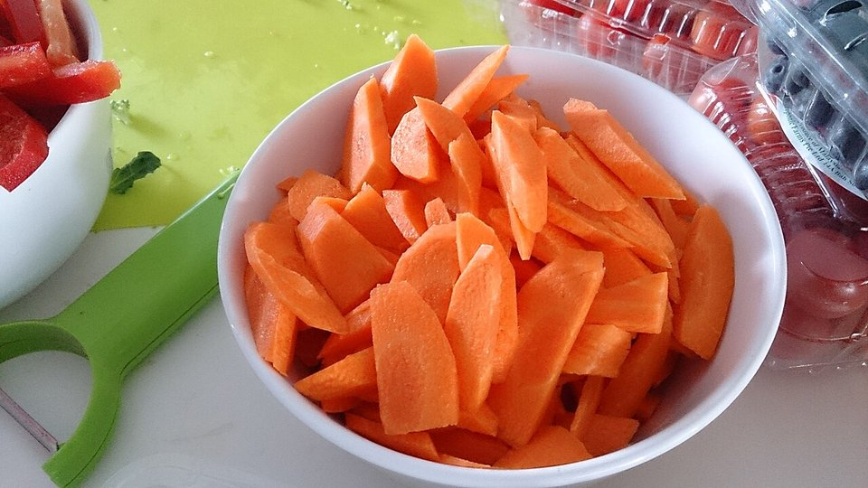

---

## Chiffonade

Chiffonade is a ribbon cut for leaves, not roots — it does not apply to
a carrot, which is why this slide shows basil rather than carrot. No
standard ribbon width is documented in the culinary references checked
for this deck, so none is given.

The same reasoning still holds: a rolled and sliced leaf exposes far
more cut edge per gram than a whole one, and wilts faster for it.

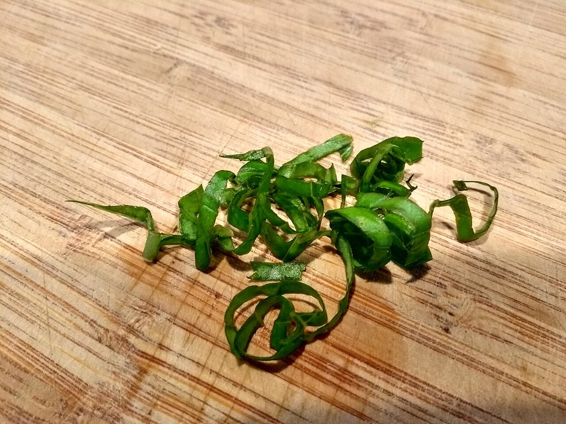

---

{/* _class: banner */}

# Storage: shelf, drawer, cold or not

---

## Not refrigerated

Potatoes, sweet potatoes, whole winter squash and dry onions keep best
somewhere cool and dark.

- cold temperatures convert starch to sugar in a potato
- refrigeration **shortens** rather than extends its useful life

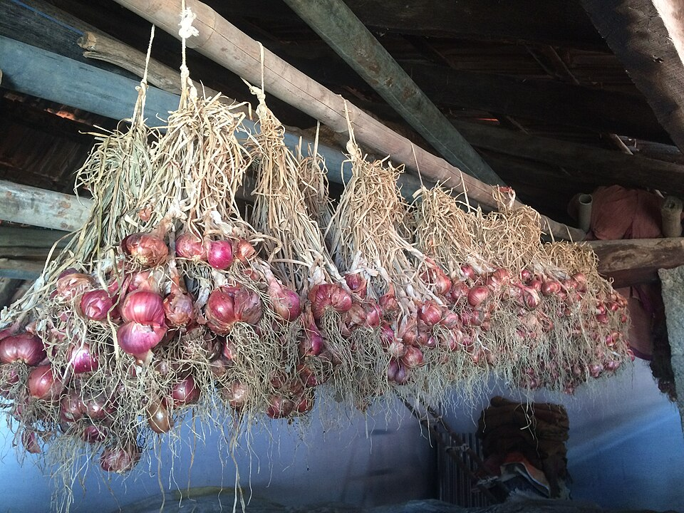

---

## Refrigerated

Leafy greens, most brassicas, carrots and herbs go into the refrigerator,
ideally in the crisper drawer.

- FDA: refrigerator at or below **4 °C (40 °F)**
- FDA: freezer at or below **−18 °C (0 °F)**
- checked with an appliance thermometer, not assumed from the dial setting

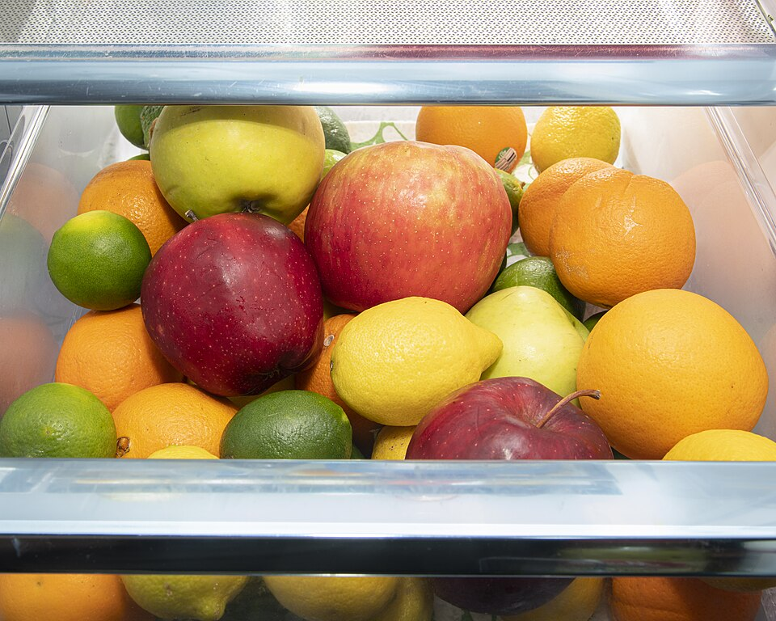

---

## Humidity setting

- **high humidity** (vent closed) — slows moisture loss, suits leafy
  greens
- **low humidity** (vent open) — lets moisture and ethylene escape, suits
  produce that would soften faster sealed and damp

University of Arkansas Cooperative Extension: leafy greens, broccoli and
asparagus belong in the high-humidity drawer.

---

{/* _class: banner */}

# Ethylene: producers and the sensitive

---

## What ethylene does

Ethylene is a plant hormone that accelerates ripening — and, past a
point, decay — in whatever produce sits near it.

---

## Producers versus sensitive

USDA Agricultural Marketing Service technical report on ethylene:

| Role | Produce |
|---|---|
| High producers | apples, bananas, avocados, pears, stone fruit, tomatoes |
| Sensitive | leafy greens, broccoli, carrots, cucumbers |

---

## Why the separation matters

Separating the two groups — different drawers, or at minimum not sealed
together in the same bag — is the single highest-value habit this week
teaches.

Week 9 returns to this same chemistry from the fruit side of the
exchange.

---

{/* _class: banner */}

# Choosing well at market

---

## Three checks before anything goes in a bag

- **firmness** — already soft is already declining
- **colour** — discoloured at cut edges is already declining
- **smell** — faintly fermented is already declining

Storage can only slow a decline that has already started; it cannot
reverse it.

---

## Colour at the cut face

<figure>

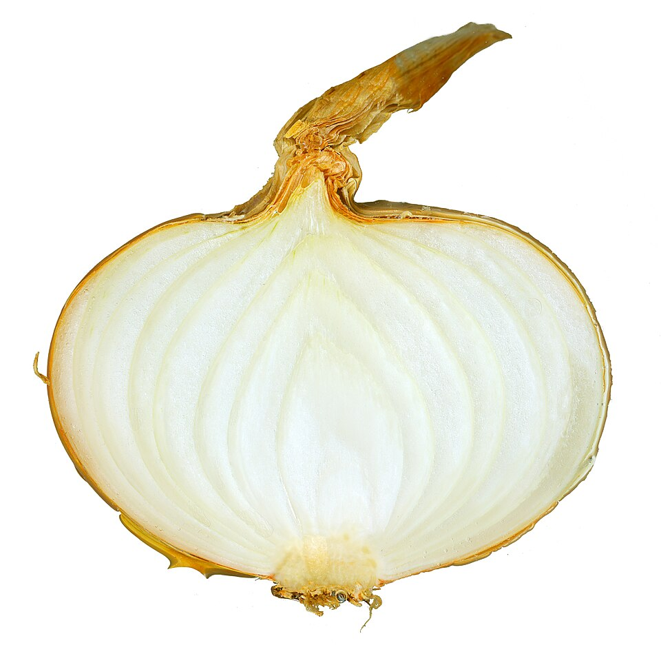

<figcaption>Fresh: pale and translucent from edge to centre.</figcaption>

</figure>

<figure>

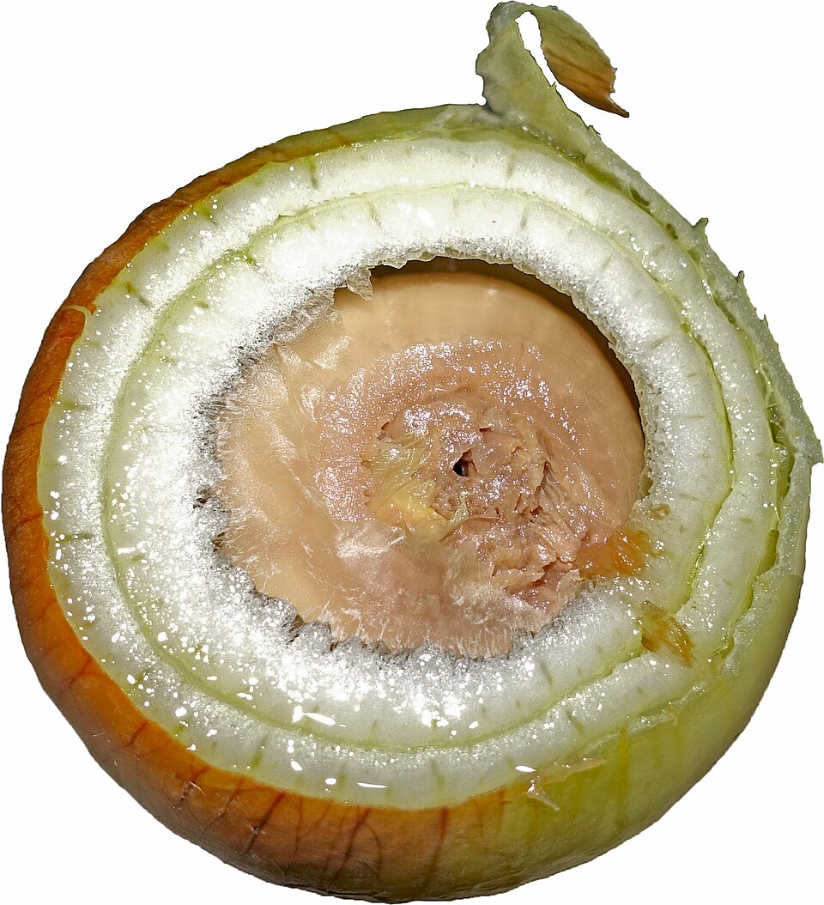

<figcaption>Held past its useful storage life: the centre has browned
and softened; the outer rings have not.</figcaption>

</figure>

The colour check named on the previous slide is exactly this: onion is
this week's example, but the same cut-face comparison applies to any
vegetable bought whole.

---

{/* _class: banner */}

# Nutrition: common vegetables

---

## Roots, tubers and alliums, per 100 g

Figures are for the raw, edible portion, from USDA FoodData Central — the
same database the invent-a-recipe assessment names.

| Vegetable | kcal | Fat (g) | Protein (g) | Fibre (g) | FDC ID |
|---|---|---|---|---|---|
| Potato, flesh and skin, raw | 77 | 0.10 | 2.05 | 2.10 | 170026 |
| Carrot, raw | 41 | 0.24 | 0.93 | 2.80 | 170393 |
| Onion, raw | 40 | 0.10 | 1.10 | 1.70 | 170000 |
| Garlic, raw | 149 | 0.50 | 6.36 | 2.10 | 169230 |

---

## Leafy greens and brassicas, per 100 g

Same source and convention as the previous slide.

| Vegetable | kcal | Fat (g) | Protein (g) | Fibre (g) | FDC ID |
|---|---|---|---|---|---|
| Spinach, raw | 23 | 0.39 | 2.86 | 2.20 | 168462 |
| Lettuce, cos/romaine, raw | 17 | 0.30 | 1.23 | 2.10 | 169247 |
| Broccoli, raw | 34 | 0.37 | 2.82 | 2.60 | 170379 |
| Cauliflower, raw | 25 | 0.28 | 1.92 | 2.00 | 169986 |

---

## What the numbers say

- none of the eight is a meaningful source of fat
- calorie content tracks carbohydrate and water content, not protein or
  fat — garlic's low water content is why it is the outlier at 149 kcal
- the tutorial's macro calculator offers five of these — onion, carrot,
  potato, spinach and broccoli — using the same per-100 g figures shown
  here; garlic, lettuce and cauliflower widen this table beyond what the
  calculator currently selects from

---

{/* _class: quote */}

> Vegetables are frequently the largest component by weight in a
> prepared recipe, and the easiest to assume is nutritionally
> interchangeable. It is not.
>
> — Marisol Quaye

---

{/* _class: centered */}

## Reading

- [FDA — Are You Storing Food
  Safely?](https://www.fda.gov/consumers/consumer-updates/are-you-storing-food-safely)
- [FDA — Selecting and Serving Produce
  Safely](https://www.fda.gov/food/buy-store-serve-safe-food/selecting-and-serving-produce-safely)
- [Auguste Escoffier School of Culinary Arts — Knife Skills: 10 Knife
  Cuts Every Professional Cook Should
  Know](https://www.escoffier.edu/blog/culinary-arts/8-knife-cuts-every-professional-cook-should-know/)
- [FoodSafety.gov — Cold Food Storage
  Chart](https://www.foodsafety.gov/food-safety-charts/cold-food-storage-charts)
- [University of Arkansas Cooperative Extension Service — Spoiled
  Rotten](https://www.uaex.uada.edu/counties/miller/news/fcs/fruits-veggies/Spoiled-Rotten-How-to-Store-Fruits-and-Vegetables.aspx)
- [USDA AMS — Technical Report, Ethylene
  (Crops), 2023](https://www.ams.usda.gov/sites/default/files/media/EthyleneCropsTechnicalReport2023.pdf)
- [USDA FoodData Central](https://fdc.nal.usda.gov/)

Session 2's tutorial exercises the macro calculator on five of this
week's vegetables. Next: week 3 moves to animal protein, starting with
poultry and fish.
