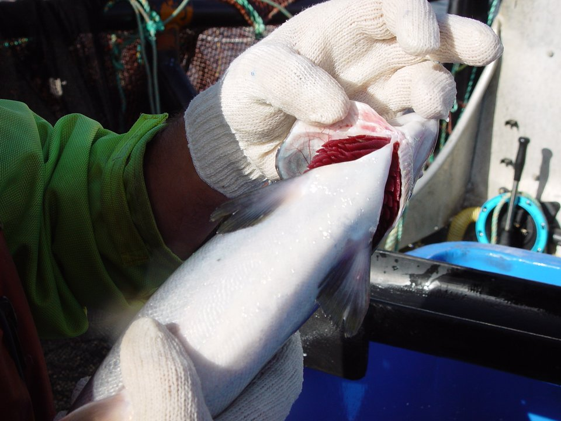

{/* _class: impact */}

# Animal protein I

## Poultry and fish

SLOP1640 — week 3

Idris Fenn

---

## Order, deliberate

Chicken and fish are the primary material this week; duck is touched on
briefly as a point of contrast.

- anatomy first — so the reason a cut behaves the way it does is
  visible before any handling instruction is given
- handling second — so the anatomy explains the rule rather than the
  rule sitting on its own

---

{/* _class: banner */}

# Anatomy

---

## The bird: leg and thigh versus breast

- leg and thigh work constantly — walking, standing, bearing weight
- more connective tissue, more slow-twitch, myoglobin-rich fibre
  ("dark meat")
- the breast, in a bird that does not fly far, does comparatively little
  work — leaner, paler
- fat sits mostly under the skin, not running through the muscle

---

## Duck, briefly

A bird bred for sustained flight or cold-water swimming differs mainly
in degree:

- thicker subcutaneous fat layer
- darker meat across the whole carcass, including the breast
- meat only, raw, per 100 g: 135 kcal, 5.95 g fat, 18.28 g protein, 2.4 mg
  iron (FDC ID 172410) — more than six times chicken breast's iron,
  consistent with dark meat running through the whole bird

---

## Fish anatomy

Fish have no need to support their own weight against gravity.

- connective tissue is thinner than in poultry or red meat
- muscle is arranged in short segments (myotomes), not long fibres
- this is why fish flakes apart along clean lines under far less force
- fillets are portioned along those natural seams, not cut across them

---

## Fish portion forms

Portion form follows the same seams. A **fillet** runs the length of one
side of the fish; a **steak** (or darne) is a cross-section through the
whole fish, backbone included; a **supreme** is a skinless, boneless
fillet portion. The pin-bone line — a row of small bones down the centre
of each fillet — is a separate anatomical feature from the myotome
seams that set where a fillet can be taken cleanly.

---

{/* _class: banner */}

# Choosing well

---

## Fish, checked before it is bought

A fish's anatomy is what a freshness check actually reads. Four checks,
each traceable to a visible or smellable change as the fish ages:

- **eyes** — clear and shiny when fresh; cloudiness is the sign to
  refuse
- **gills** — bright red when fresh; dulling toward brown or grey marks
  decline
- **flesh** — springs back when pressed; flesh that stays indented has
  already begun to break down
- **smell** — mild, of the sea; ammonia or sourness means the fish
  should be refused, not just discounted

---

## Eyes and gills together, on one fish

No matched pair of a fresh and a declining fish, comparably
photographed, could be sourced — the epic's own sourcing risk,
realised. This single, labelled close-up names the checks it shows; it
does not stand in for a comparison.

Scale condition, a fifth check, is not documented in the FDA source
above; the freshness-grading standard on the next slide covers it.

---

## What the grading standard adds

The EEC freshness grading system used across European fish markets
extends the same four checks with published wording, and adds scale and
skin condition as a fifth:

- top-grade eyes are described as **convex**; the flattest, most
  sunken eyes and greyed, opaque corneas mark the unfit end of the scale
- top-grade skin and scales are **bright, shining and iridescent**,
  loosening and dulling as the fish declines
- gill colour and odour move the same direction already named above

This is a grading standard, not a safety threshold — a fish graded below
top quality is not automatically unsafe — but the direction of every
change matches the FDA checks above.

---

{/* _class: banner */}

# Handling

---

## Cold chain

Raw poultry and raw fish are both perishable enough that the two-hour
rule applies:

- never left out of refrigeration more than **2 hours**
- more than **1 hour** if the ambient temperature is above 32 °C
- bacteria common to raw poultry and seafood grow fastest between
  **4 °C and 60 °C**, and can double in as little as **20 minutes**
  within that band

---

## Cross-contamination

A cutting board and knife used on raw poultry or fish should not touch
produce, or anything already cooked, without being washed first.

- hot, soapy water, a clean rinse, a full dry — or a dishwasher cycle for
  a nonporous board
- the point is not fastidiousness: the same organisms that make raw
  poultry and fish perishable transfer readily to whatever the board
  touches next

---

## Portioning

Work with the anatomy already established, not across it.

- poultry — broken down along the joints, where connective tissue is
  thinnest, avoiding splintered bone
- fish — portioned along the myotome seams and away from the pin bones

---

## What the eight-piece breakdown costs

Jointing a whole bird into leg, thigh, drumstick, wing and two breast
halves does not shorten the refrigerated window — FDA's storage chart
holds whole poultry and poultry parts to the same 1–2 days at 4 °C or
below. What it does shorten is frozen quality life: about 9 months for
parts against about 1 year for a whole bird, the same figures already
on this week's poultry storage table.

No equivalent figure is documented for fish portion form. FDA's chart
distinguishes fish storage by fat content — lean versus fatty — not by
whether the fish is left whole or cut into fillets or steaks, so no
holding-time cost is claimed for fish portioning here.

---

{/* _class: banner */}

# Storage and safe holding times

---

## Poultry

| State | Temperature | Holding time |
|---|---|---|
| Refrigerated | 4.4 °C (40 °F) or below | 1–2 days |
| Frozen | −17.8 °C (0 °F) or below | indefinite; quality falls off after ~9 months (parts) / ~1 year (whole bird) |

The 4.4 °C line is a target to verify, not to assume — an appliance
thermometer left on the shelf is the only way to know the refrigerator
itself is holding it, rather than trusting the dial on the door.

---

## Fish and shellfish

- same **1–2 day** window under refrigeration
- onto ice or into the fridge within **2 hours** of purchase
- **1 hour** if the ambient temperature is above 32 °C

These are food-safety limits, not cooking instructions — this week
teaches a student to read the storage clock, not to cook against it.

---

{/* _class: banner */}

# Nutrition

---

## Fat, protein and calories per 100 g

Raw, from USDA FoodData Central — the same database the invent-a-recipe
assessment names, and the same four materials Session 3's tutorial
ranks.

| Material | Calories (kcal) | Fat (g) | Protein (g) | FDC ID |
|---|---|---|---|---|
| Chicken breast, meat only, raw | 120 | 2.62 | 22.5 | 171077 |
| Salmon, Atlantic, farmed, raw | 208 | 13.42 | 20.42 | 175167 |
| Cod, Atlantic, raw | 82 | 0.67 | 17.81 | 171955 |
| Duck, meat only, raw | 135 | 5.95 | 18.28 | 172410 |

---

## Why salmon's figure is higher

Salmon's higher fat figure is consistent with the anatomy already
covered: a cold-water swimmer stores more fat through its flesh than a
bird whose breast, in particular, was bred to do comparatively little
work.

---

## Iron, and the same dark-meat story again

A second nutrient, read off the same four USDA entries:

| Material | Iron (mg) | FDC ID |
|---|---|---|
| Chicken breast, meat only, raw | 0.37 | 171077 |
| Salmon, Atlantic, farmed, raw | 0.34 | 175167 |
| Cod, Atlantic, raw | 0.38 | 171955 |
| Duck, meat only, raw | 2.40 | 172410 |

Duck — dark meat across the whole carcass — carries by far the most
iron; chicken breast, the leanest, whitest muscle at this table, carries
the least. The two fish sit close together in between, without the
light-meat/dark-meat split that separates the two birds.

---

{/* _class: quote */}

> Anatomy explains what a cut can do; handling determines whether it is
> still safe to do it by the time it reaches a pan.
>
> — Idris Fenn

---

{/* _class: centered */}

## Reading

- [USDA FSIS — "The Poultry Label Says
  'Fresh'"](https://www.fsis.usda.gov/food-safety/safe-food-handling-and-preparation/poultry/poultry-label-says-fresh)
- [FDA / FoodSafety.gov — Safe Selection and Handling of Fish and
  Shellfish](https://www.foodsafety.gov/blog/safe-selection-and-handling-fish-and-shellfish)
- [FAO — Guide to EEC Freshness
  Grades](https://www.fao.org/4/V7180E/V7180E14.HTM)
- [USDA FSIS — "Danger Zone" (40 °F–140
  °F)](https://www.fsis.usda.gov/food-safety/safe-food-handling-and-preparation/food-safety-basics/danger-zone-40f-140f)
- [USDA FSIS — Cutting
  Boards](https://www.fsis.usda.gov/food-safety/safe-food-handling-and-preparation/food-safety-basics/cutting-boards)
- [FDA — Refrigerator & Freezer Storage
  Chart](https://www.fda.gov/media/74435/download)
- [USDA FoodData Central](https://fdc.nal.usda.gov/)

Session 3's tutorial exercises the macro calculator on all four of this
week's materials — chicken breast, salmon, cod and duck. Next: week 4
applies the same anatomy-then-handling structure to red meat.
