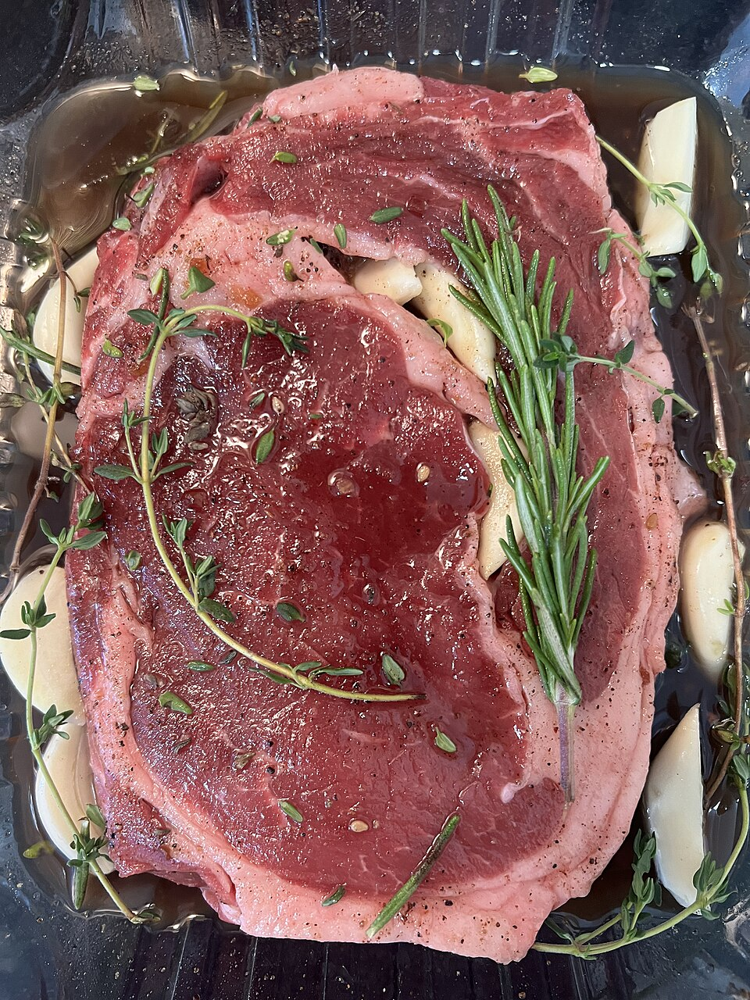
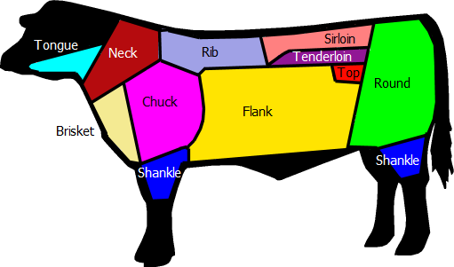
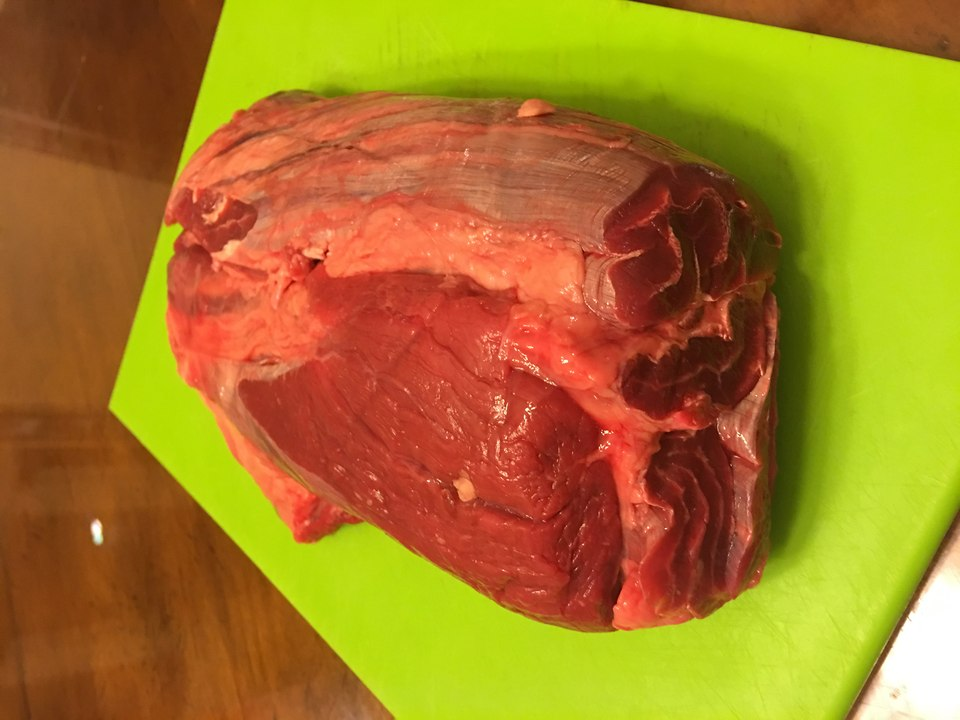
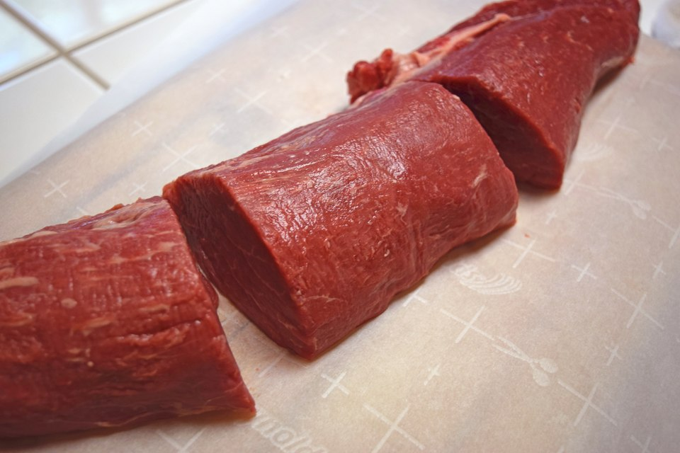
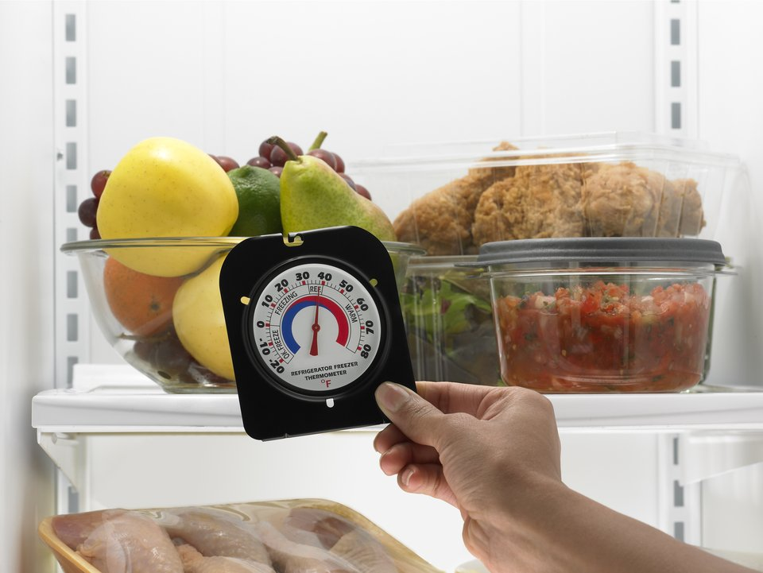
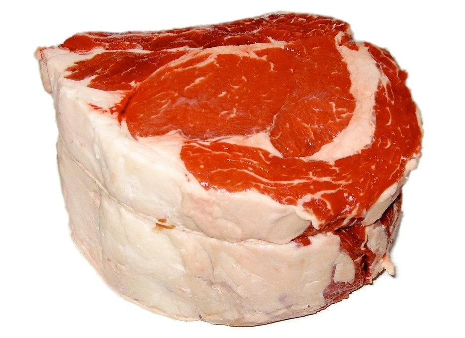
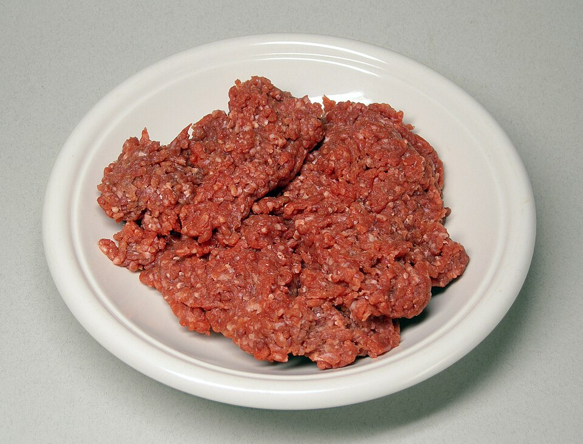
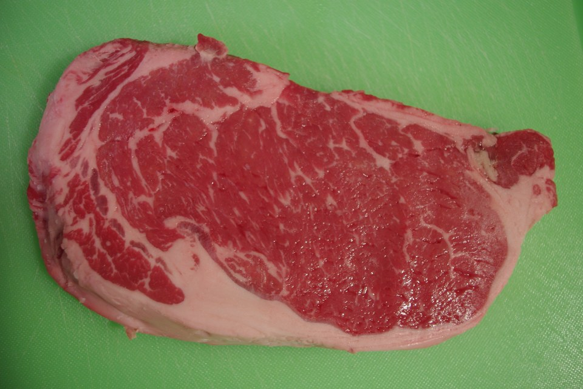

{/* _class: impact */}

# Animal protein II

## Red meat

SLOP1640 — week 4

Idris Fenn

---

## The same structure, on purpose

Last week's structure repeats here: anatomy first, then handling, then
portioning.

- beef is the primary material — the animal most students will have
  handled in the widest range of cuts
- goat and lamb are the same argument applied to a smaller frame with a
  different fat distribution, not a separate topic

---

{/* _class: banner */}

# Anatomy: why some cuts are tough and some are not

---

## Worked muscle versus resting muscle

A cut's texture is a direct record of what the muscle did in the living
animal.

- leg, shoulder, neck — worked constantly against load, dense fibre,
  high collagen (chewy, unrendered)
- loin, along the animal's back — did comparatively little work, far
  less connective tissue, finer grain

<figure>

</figure>

<figure>

</figure>

<figure>

</figure>

---

## What follows from that

- tender with minimal treatment
- dries out rather than softens if treated the way a shoulder is treated
- fat accumulates where the animal stored energy, not where it worked
  hardest — a related but separate logic from connective tissue

---

## Goat and lamb, briefly

- proportionally less external fat than beef of a comparable cut
- smaller muscle groups — connective tissue is a larger share of any
  given cut's mass

---

## Treatment follows anatomy, not convention

- high-collagen cut — needs time and moisture for collagen to convert
  to gelatin
- low-collagen cut — gains nothing from the time a tougher cut requires
- an anatomical answer, even though tradition usually arrives at the
  same answer by trial rather than by dissection

---

{/* _class: banner */}

# Handling and portioning

---

## Unchanged from week 3

- refrigerate promptly — within **2 hours**, **1 hour** above 32 °C
  (90 °F)
- keep at or below **4 °C**
- treat any surface or tool that has touched raw meat as contaminated
  until washed

---

## Portioning

Along, rather than across, the direction of connective tissue and
fibre — this is what makes a portion cook predictably.

The same logic scales with portion size. A primal cut carries the
least surface per gram; breaking it down for sale or for the kitchen
adds cut surface, and cut surface is where surface bacteria take hold
first. Carried to its extreme — grinding — that is why ground red meat
keeps for **2 days** against the **3–5 days** a whole cut keeps (see
*Whole cuts versus ground*, ahead).

---

{/* _class: banner */}

# Storage windows

---

## Whole cuts versus ground

| Material | Refrigerated window |
|---|---|
| Beef, veal, lamb, pork (whole cuts) | 3–5 days |
| Poultry, fish (week 3) | 2 days |
| Ground/minced red meat | 2 days |

Grinding mixes surface bacteria through the whole volume, so ground red
meat follows the shorter window rather than the longer whole-cut one.

<figure>

</figure>

<figure>

</figure>

---

## The danger zone, unchanged

The **4 °C to 60 °C** danger zone applies identically to red meat as to
poultry and fish.

---

{/* _class: banner */}

# Choosing well

---

## Bright red, then brown: oxidation, not spoilage

A freshly cut surface is bright cherry red; refrigerated, it turns
brown. Same pigment, myoglobin, in different chemical states — not
different levels of safety.

- **oxymyoglobin** — myoglobin freshly bound to oxygen, bright red,
  the colour of a cut just made or a package just opened
- **metmyoglobin** — the same pigment further oxidised by air and
  store lighting, brown
- USDA FSIS: this colour shift alone does not mean the meat has
  spoiled — an intact cut's interior is often greyish from lack of
  oxygen, which is normal

---

## What actually indicates spoilage

Colour records what a surface has been doing chemically since it was
cut. It does not, by itself, say whether the meat is still sound. FSIS
names three checks that do:

- **slime or tackiness** on the surface — a texture change, not a
  colour change
- **an off odour** — sour or otherwise unlike the neutral smell of
  fresh meat
- **the date** on the label, read against how long the meat has
  actually been held

None of the three is colour. A brown cut with none of them is
oxidised; a bright red cut with any one of them is not fresh, whatever
its colour says.

---

{/* _class: banner */}

# Nutrition: two beef blends, lamb and goat

---

## Two ground-beef blends, per 100 g

Raw, from USDA FoodData Central — the same two blends, and the same
figures, that this week's tutorial calculator uses.

| Cut | Calories (kcal) | Fat (g) | Protein (g) | Iron (mg) | FDC ID |
|---|---|---|---|---|---|
| Beef, ground, 85% lean / 15% fat, raw | 215 | 15.0 | 18.59 | 2.09 | 171796 |
| Beef, ground, 93% lean / 7% fat, raw | 152 | 7.0 | 20.85 | 2.33 | 173110 |

---

## Lamb leg and goat, per 100 g

Same source and convention as the previous slide. Both are whole raw
cuts, not ground, and both sit in the calculator as the lower-fat
comparison point against the two beef blends.

| Cut | Calories (kcal) | Fat (g) | Protein (g) | Iron (mg) | FDC ID |
|---|---|---|---|---|---|
| Lamb, domestic, leg, whole, raw | 230 | 17.2 | 17.91 | 1.66 | 174311 |
| Goat, raw | 109 | 2.3 | 20.6 | 2.83 | 175303 |

---

## What the numbers say

- fat is where the four separate most clearly — from 2.3 g in goat to
  17.2 g in the whole lamb leg, a wider spread than the two beef blends
  show against each other
- iron does not track fat the same way: goat, the leanest of the four,
  also carries the most iron per 100 g; lamb leg, the fattiest, carries
  the least
- which cut a recipe should reach for is still the anatomy question
  covered above, not a question the nutrition table settles

---

{/* _class: quote */}

> Which cuts suit which treatment is a question with an anatomical
> answer, even when tradition gets there first.
>
> — Idris Fenn

---

{/* _class: centered */}

## Reading

- [USDA FSIS — Keep Food Safe! Food Safety
  Basics](https://www.fsis.usda.gov/food-safety/safe-food-handling-and-preparation/food-safety-basics/steps-keep-food-safe)
- [USDA FSIS — "Danger Zone" (40 °F–140 °F / 4 °C–60
  °C)](https://www.fsis.usda.gov/food-safety/safe-food-handling-and-preparation/food-safety-basics/danger-zone-40f-140f)
- [USDA FSIS — The Color of Meat and
  Poultry](https://www.fsis.usda.gov/food-safety/safe-food-handling-and-preparation/food-safety-basics/color-meat-and-poultry)
- [USDA FSIS — Beef From Farm to
  Table](https://www.fsis.usda.gov/food-safety/safe-food-handling-and-preparation/meat-catfish/beef-farm-table)
- [USDA FoodData Central](https://fdc.nal.usda.gov/)

Session 4's tutorial exercises the macro calculator on two ground-beef
blends, lamb leg and goat. Next: week 5 moves from anatomy to what
processing does to aromatics.
