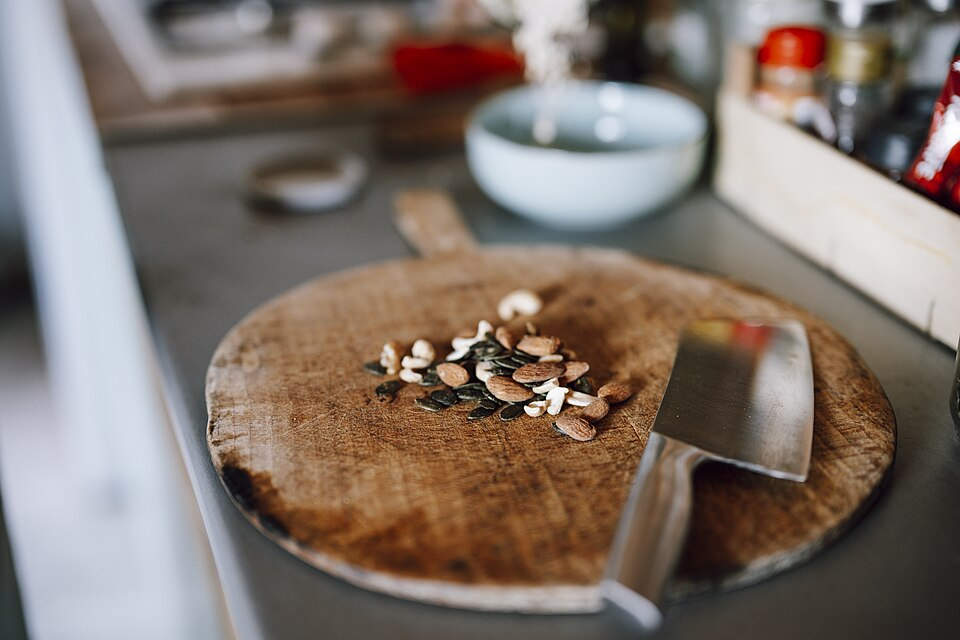
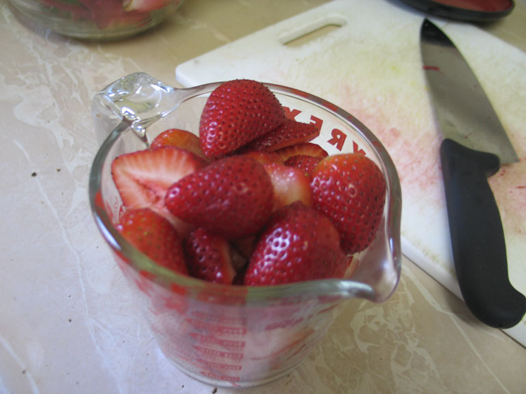

{/* _class: impact */}

# The kitchen: tools and surfaces

SLOP1640 — week 6

Idris Fenn

---

## The inventory

A kitchen's non-heat tools fall into a small number of categories, each
with a job distinct from the others.

- a **cutting board** to work on
- a **chopper** — knife or cleaver — to cut with
- **strainers** to separate solid from liquid
- **containers** to hold what has already been prepared

None of this week is about technique with any of these tools. The knife
itself is week 7's subject; this week is about the tools and surfaces as
objects that need choosing and maintaining, not used.

---

{/* _class: banner */}

# Board material, compared honestly

---

## Three materials, no outright winner

Wood, plastic and marble each trade off differently across hygiene,
knife wear and particle shedding.

| Material | Knife wear | Hygiene | Particle shedding |
|---|---|---|---|
| Wood | low | good, if dried properly | low |
| Plastic | low | good, until scarred | measurable (see below) |
| Marble | high | good | lowest |

No single material wins on all three axes at once — choosing a board is
choosing which trade-off to accept.

---

## Wood

- kind to knife edges: the surface yields slightly rather than blunting
  the blade
- a well-maintained wood board is not automatically less hygienic than
  plastic — wood's natural porosity can draw liquid, and the bacteria in
  it, below the surface, away from a subsequent cut
- that benefit depends entirely on the board being dried properly; a
  wood board left wet loses the advantage
- requires more upkeep than the other two: periodic oiling, and it
  cannot go in a dishwasher

---

## Plastic

- dishwasher-safe and cheap to replace
- gentle on edges, similar to wood
- takes knife scarring readily — visible cut marks accumulate, and once
  deep enough are harder to clean thoroughly than a smooth surface
- a heavily scored plastic board is the usual case for replacement
  rather than continued use, for exactly that reason

---

## Marble and other hard stone

- the hardest of the three materials, so the least forgiving to a knife
  edge — it dulls a blade faster than wood or plastic
- sheds comparatively little material of its own into whatever is cut on
  it
- heavy, can chip, and is mostly chosen for pastry work — a cold,
  non-porous surface helps there — rather than as a general-purpose
  board

---

{/* _class: banner */}

# What cutting does to the board — and the food

---

## The Yadav et al. (2023) finding

Every board sheds some material into whatever is chopped on it. [Yadav
et al. (2023), in *Environmental Science &
Technology*](https://pubs.acs.org/doi/abs/10.1021/acs.est.3c00924),
measured microplastic release from polyethylene and polypropylene
cutting boards during normal chopping.

- a substantial number of microplastic particles could be generated and
  transferred to food this way
- the [American Chemical Society's press
  summary](https://www.acs.org/pressroom/presspacs/2023/june/cutting-boards-can-produce-microparticles-when-chopping-veggies.html)
  frames cutting boards as an overlooked source of microplastic exposure
  through food, distinct from the packaging and water sources more
  commonly discussed

---

## Reporting the finding honestly

The same study tested the released particles against cultured mouse
fibroblast cells over 72 hours.

- **found:** no significant effect on cell viability at the
  concentrations tested
- the authors characterised this as an open question, not a closed one,
  and called for further research into the health effects of dietary
  microplastic exposure

Both halves of that sentence are part of the finding. Reporting only the
headline — particles transfer to food — without the 72-hour cell-viability
result is not deadpan, it is alarmist; reporting only the null cell result
without the transfer finding understates what was actually measured.

---

{/* _class: banner */}

# Maintenance

---

## The same rule, three surfaces

Strainers and containers are maintained by the same basic rule as
boards:

- wash promptly after use
- dry fully before storing
- replace anything whose surface has degraded to the point of trapping
  food or liquid — a cracked container lid, a strainer mesh that has
  started to distort

---

## Wood board maintenance, specifically

- wash with hot soapy water rather than soaking
- dry standing on edge, so air reaches both faces
- oil periodically with a food-safe mineral or specialist board oil

Cracking from drying out is the main failure mode wood is prone to that
plastic and stone are not — the maintenance routine above exists
specifically to prevent it, not as generic good practice.

---

{/* _class: banner */}

# Why this sits before the knife

---

## The surface the cut lands on

A knife is only as good as the surface it works against.

- week 7 covers blade geometry, sharpening and cuts in detail
- this week's board and tool choices set the surface those cuts land on
- a board that dulls an edge faster than it needs to is a preparation
  cost paid every time it is used, not once

This week has no tutorial exercise — there is no ingredient or storage
decision here to run a calculator against. The decision this week
practices is a purchasing and maintenance one, made once and then
sustained.

---

{/* _class: quote */}

> The board is the one tool in this kitchen that never announces when it
> has failed you. A blunt knife tells you immediately. A board that has
> been drying out for a month tells you nothing, until it splits.
>
> — Idris Fenn

---

{/* _class: centered */}

## Reading

- Yadav et al. (2023), [*Cutting Boards: An Overlooked Source of
  Microplastics in Human
  Food?*](https://pubs.acs.org/doi/abs/10.1021/acs.est.3c00924),
  Environmental Science & Technology.
- American Chemical Society, [press summary of Yadav et al.
  (2023)](https://www.acs.org/pressroom/presspacs/2023/june/cutting-boards-can-produce-microparticles-when-chopping-veggies.html).

Next: week 7 — the knife itself, the most detailed week in the course.
