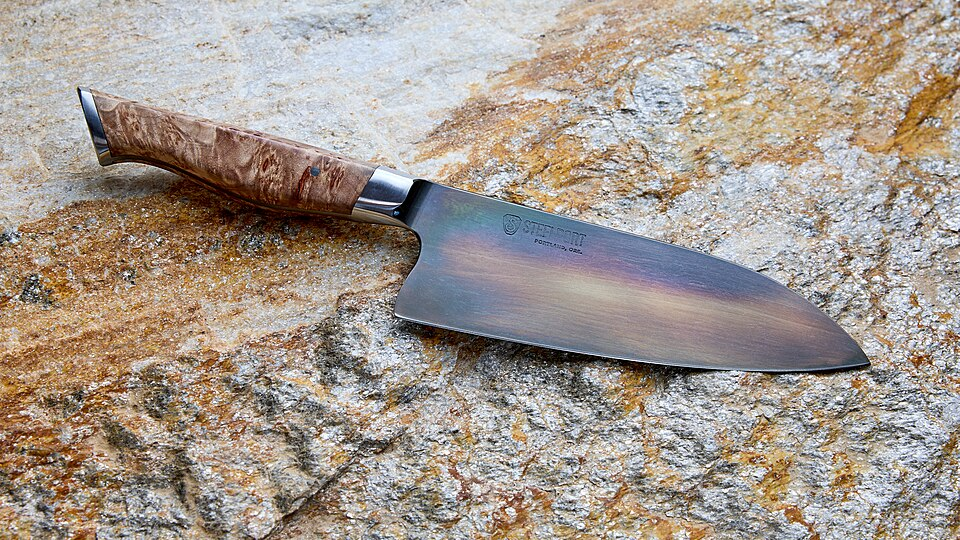
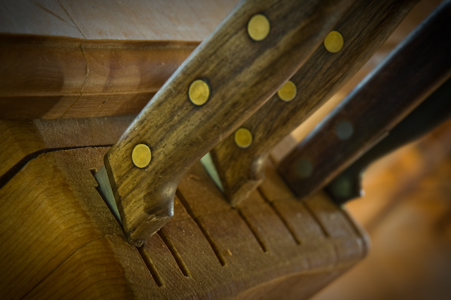
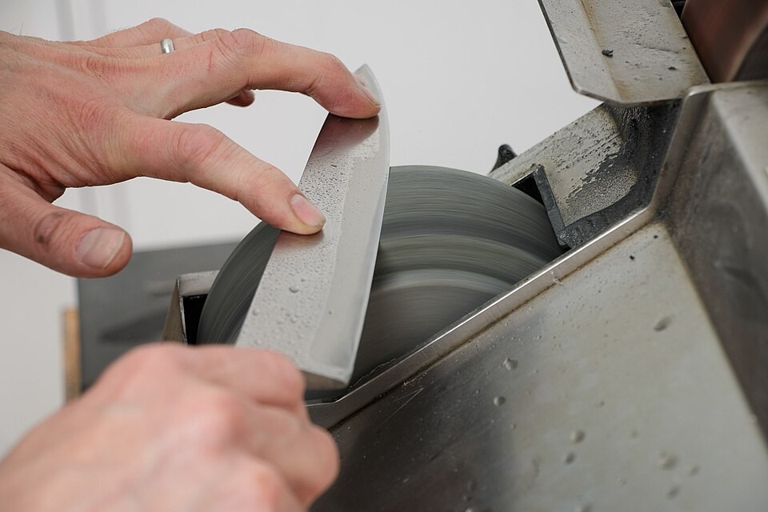
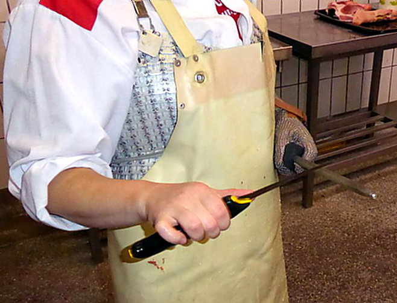
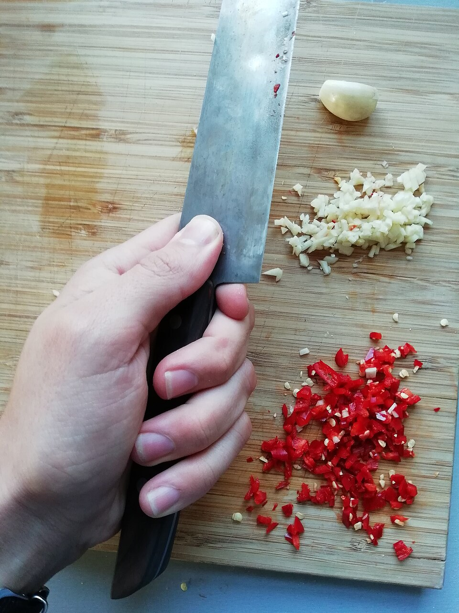

{/* _class: impact */}

# The knife

SLOP1640 — week 7

Idris Fenn

---

## Why this week is different

Every other week in this course is argued in prose. This one is
demonstrated: a blade either does what its geometry predicts or it
doesn't, and the difference is visible in the cut, not in a description of
it.

- one idea per slide, one demonstration per idea
- nothing here is cooked — the knife prepares, it does not heat
- what a bad cut costs later is the subject of week 10

---

{/* _class: banner */}

# Knife types

---

## The working set

| Knife | Typical use |
|---|---|
| Chef's / cook's knife | general chopping, slicing, dicing |
| Paring knife | small, in-hand work: peeling, trimming, coring |
| Utility knife | mid-sized jobs a chef's knife is too large for |
| Boning knife | separating meat from bone, thin and flexible |
| Filleting knife | fish, thinner and more flexible again |
| Bread knife | serrated, saws rather than presses through a crust |
| Cleaver | heavy, chops through bone and cartilage by weight, not edge angle |

---

## A drawer holding several of them

A knife's shape is an answer to a specific cutting problem. A cleaver and a
paring knife are not the same tool used at different scales — they solve
different problems, which is why a kitchen keeps more than one.

---

{/* _class: banner */}

# Blade geometry

---

## Anatomy of a blade

- **spine** — the unsharpened top edge; where downward force is applied
- **edge** — the cutting surface, ground to an angle on one or both sides
- **bevel** — the ground surface behind the edge that creates that angle
- **heel** — the back of the edge, nearest the handle; does the heavy work
- **tip** — the front of the edge; does fine, controlled work
- **bolster** — the collar between blade and handle on some Western knives
- **tang** — the blade metal that continues into the handle

A knife with no tang running into the handle is a knife that will fail at
the handle first, regardless of what the edge can do.

---

## The blade in profile

<svg viewBox="0 0 700 240" width="1000" style="max-width: 100%; height: auto; max-height: 420px; display: inline-block;" role="img" aria-label="Labelled diagram of a chef's knife in profile, showing the spine, edge, bevel, heel, tip, bolster and tang">
  <rect x="0" y="0" width="700" height="240" rx="12" fill="rgba(255,255,255,0.04)" />
  <rect x="110" y="100" width="80" height="20" fill="none" stroke="currentColor" stroke-width="1.5" stroke-dasharray="4 3" />
  <rect x="20" y="90" width="150" height="40" rx="6" fill="#8a5a34" />
  <rect x="165" y="85" width="20" height="50" fill="#9a9a9a" />
  <polygon points="185,95 600,108 620,110 500,140 185,135" fill="#b9bec4" />
  <line x1="200" y1="128" x2="580" y2="112" stroke="#7d8286" stroke-width="2" />
  <line x1="350" y1="70" x2="400" y2="100" stroke="currentColor" stroke-width="1" />
  <line x1="380" y1="190" x2="400" y2="138" stroke="currentColor" stroke-width="1" />
  <line x1="480" y1="75" x2="450" y2="119" stroke="currentColor" stroke-width="1" />
  <line x1="140" y1="180" x2="190" y2="132" stroke="currentColor" stroke-width="1" />
  <line x1="630" y1="75" x2="615" y2="112" stroke="currentColor" stroke-width="1" />
  <line x1="175" y1="60" x2="175" y2="88" stroke="currentColor" stroke-width="1" />
  <line x1="60" y1="180" x2="140" y2="110" stroke="currentColor" stroke-width="1" />
  <text x="350" y="62" font-size="16" text-anchor="middle" fill="currentColor">spine</text>
  <text x="380" y="205" font-size="16" text-anchor="middle" fill="currentColor">edge</text>
  <text x="480" y="62" font-size="16" text-anchor="middle" fill="currentColor">bevel</text>
  <text x="140" y="197" font-size="16" text-anchor="middle" fill="currentColor">heel</text>
  <text x="630" y="62" font-size="16" text-anchor="middle" fill="currentColor">tip</text>
  <text x="175" y="52" font-size="16" text-anchor="middle" fill="currentColor">bolster</text>
  <text x="60" y="197" font-size="16" text-anchor="middle" fill="currentColor">tang</text>
</svg>

---

## Edge angle and hardness trade off

The edge angle is measured per side, not across the whole edge. A wider
angle behind the edge is more durable and more forgiving of hard contact;
a narrower angle cuts with less resistance but needs harder, better-
supported steel to hold its shape.

- Western-style edges: roughly 17–22° per side, on softer steel
- Japanese-style edges: roughly 10–15° per side, on harder steel

Neither is objectively correct — softer steel at a wide angle survives a
line cook's pace; harder steel at a narrow angle holds a finer edge longer
but chips more easily under careless use. Choosing an edge angle is
choosing what kind of failure the knife will have.

---

## Steel and hardness

Hardness is reported on the Rockwell C scale (HRC). Kitchen knife steels
mostly fall between 52 and 65 HRC.

- **Softer (52–58 HRC)** — more resistant to chipping, easier to re-sharpen,
  loses a working edge sooner
- **Harder (58–65 HRC)** — holds a working edge longer, more brittle at the
  edge, more demanding to sharpen well

This is the same trade-off as the edge angle, restated in the metal rather
than the geometry — which is why the two move together in practice.

---

{/* _class: banner */}

# Length, weight, balance

---

## Typical dimensions

| Knife | Blade length | Approx. weight |
|---|---|---|
| Paring knife | 80–100 mm | 40–70 g |
| Utility knife | 120–150 mm | 80–120 g |
| Chef's / cook's knife | 200–250 mm | 150–220 g |
| Boning knife | 130–160 mm | 90–130 g |
| Bread knife | 200–230 mm | 150–200 g |
| Cleaver | 150–200 mm | 350–700 g |

Figures are typical manufacturer ranges, not a specification any one
knife must meet — a knife well outside these ranges is unusual, not wrong.

---

## Balance

A knife's point of balance is where it sits level across a single
finger — usually near the front of the handle or just onto the blade,
just past the bolster on a Western knife.

- balance near the handle: the blade feels lighter, favours control
- balance forward, into the blade: the blade feels heavier, favours a
  cleaver-style chop that uses its own weight

A cleaver's weight is forward on purpose. A paring knife's is not.

---

{/* _class: banner */}

# Sharpening and honing

---

## Two different operations

**Sharpening** removes metal to cut a new edge — on a whetstone, worked
through a sequence of grits from coarse to fine. It restores an edge that
honing can no longer fix.

**Honing** does not remove metal. A honing rod straightens a working edge
that has rolled slightly out of alignment under use, without cutting a new
one.

Confusing the two is the most common maintenance error: honing a blade
that needs sharpening will not restore it, because there is no metal to
straighten back into place.

Verhoeven's experimental work on sharpening geometry and edge-angle
measurement is the source most of this section draws on — see the reading
on the closing slide.

---

## Removing metal, on a wheel

---

## Maintenance schedule

The course's stated schedule for the knives used in session:

- **hone** — before each session, or when a cut starts to tear rather than
  slice
- **sharpen** — roughly every four to six weeks of regular use, or sooner
  if honing stops restoring the edge
- **inspect** — check the edge for chips or rolling before each sharpen,
  not only after

A schedule stated in advance is a maintenance decision, not a reaction to
a knife that has already failed — the same argument this course makes
about food more generally, applied to the tool.

---

## Honing, between sessions

---

{/* _class: banner */}

# Grip and the cuts

---

## Grip

- **knife hand** — pinch grip: thumb and forefinger ahead of the bolster,
  gripping the blade itself, not just the handle
- **guide hand** — fingertips curled under, knuckles forward, guiding the
  food and shielding the fingertips from the blade

The pinch grip trades the instinct to hold a knife like a hammer for
direct control over the front of the blade, which is where most of the
cutting work happens.

---

## The standard cuts

| Cut | Cross-section | Typical length |
|---|---|---|
| Julienne | 3 mm × 3 mm | 65 mm |
| Batonnet | 6 mm × 6 mm | 65 mm |
| Brunoise | 3 mm cube | — |
| Small dice | 6 mm cube | — |
| Chiffonade | ribbon, width varies | — |

Julienne and batonnet lengths — Auguste Escoffier School of Culinary Arts,
[*Knife Skills: 10 Knife Cuts Every Professional Cook Should
Know*](https://www.escoffier.edu/blog/culinary-arts/8-knife-cuts-every-professional-cook-should-know/).

---

## Why the measurement matters

A cut is a target dimension, not a style. The point of naming and
measuring it is that every piece cooks at the same rate — which is exactly
where week 10's argument about consistent preparation starts.

---

{/* _class: quote */}

> A blunt knife does not fail quietly. It fails as an uneven cut, and the
> unevenness shows up two weeks from now, in a pan, as something that looks
> like a cooking mistake.
>
> — Idris Fenn

---

{/* _class: centered */}

## Reading

Verhoeven, J. D. (2004). [*Experiments on Knife
Sharpening.*](https://archive.org/details/Experiments_on_Knife_Sharpening_John_Verhoeven)
Iowa State University, Department of Materials Science and Engineering.

Session 7 practises the grip and the cuts above under supervision. Bring
whatever is honed; nothing here is sharpened for you.
