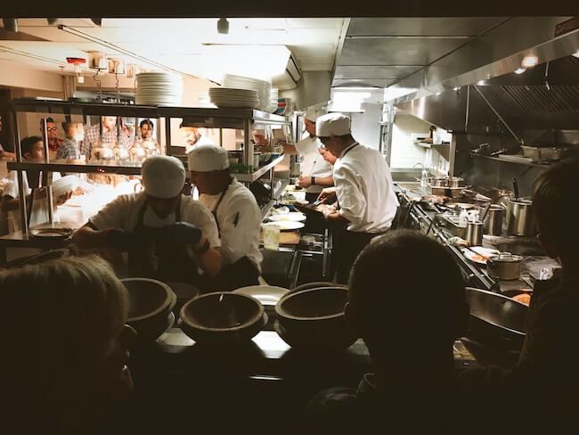
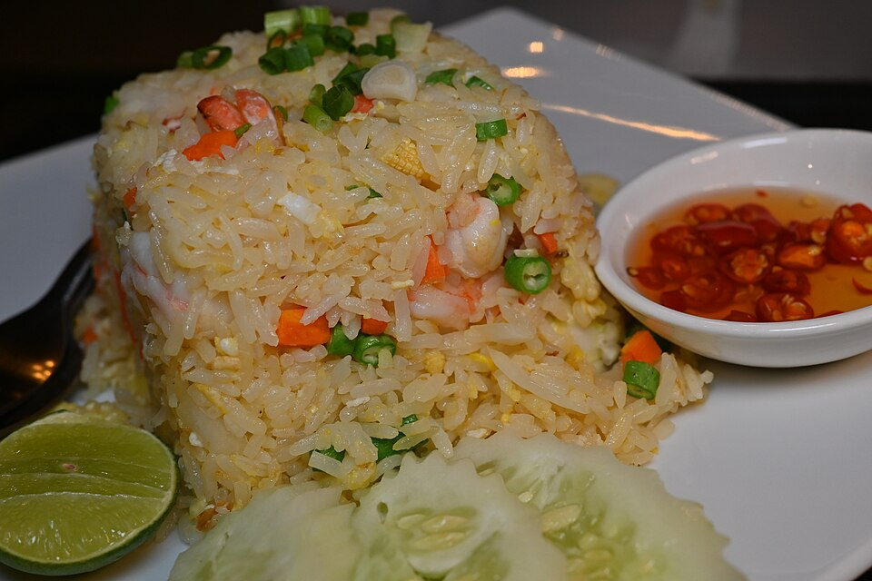

{/* _class: impact */}

# Time management under service

SLOP1640 — week 8, guest lecture

Dominic Achterberg, head chef, The Coalhouse

---

## A guest, not a member of staff

This week is taught by a visiting chef, not a member of the regular
teaching staff.

- the material is the same preparation this course has argued for since
  week 1
- now observed under a constraint the course itself cannot impose: a
  ticket that must leave the pass in a stated number of minutes, repeated
  for hours, with no allowance for a slow afternoon
- nothing in this lecture is cooked in front of the class — the subject
  is the schedule that precedes the heat

---

{/* _class: banner */}

# Before doors open

---

## Finished ahead of time

Work that is finished to completion well before service starts, because
its quality does not depend on how recently it was made.

- stocks
- cured or brined items
- anything improved by resting

This is preparation in its purest form: work done when no one is waiting
for it, at a pace the cook controls rather than the clock.

---

{/* _class: banner */}

# Held

---

## Stable, not finished

Work brought to a stable, safe intermediate state and kept there under
controlled temperature until called.

- portioned
- blanched
- staged, ready for a final step but not yet taken through it

The decision to hold rather than finish is deliberate: finishing early
would cost the item quality just as finishing late would, so it is kept
one step short of both failure points until a ticket calls for it.

---

{/* _class: banner */}

# Made to order

---

## Deliberately left undone

Work left undone until the ticket arrives, because any earlier
finishing point degrades it faster than the wait for the order does.

- the decision is not "what can be prepared ahead"
- it is "what is harmed less by waiting unfinished than by waiting
  finished"

This is the category most often assigned by habit rather than by
checking which failure mode is actually cheaper — the guest's argument
is that it should always be the latter.

---

{/* _class: banner */}

# Sequencing

---

## Deciding the order of work

Once the first three categories are fixed, the order of work across a
service still has to be decided.

- which stations depend on which others
- where a bottleneck forms if two slow items land on the same ticket
- planning for that bottleneck in advance, rather than discovering it
  mid-service

---

## The order, timed

<svg viewBox="0 0 760 120" width="1280" style="max-width: none; height: auto; max-height: 260px; display: inline-block;" role="img" aria-label="Timeline strip showing the four preparation categories in order: finished ahead, held, made to order, sequenced">
  <defs>
    <marker id="seq-arrow" markerWidth="8" markerHeight="8" refX="6" refY="4" orient="auto">
      <path d="M0,0 L8,4 L0,8 Z" fill="currentColor" />
    </marker>
  </defs>
  <rect x="10" y="30" width="160" height="60" rx="8" fill="rgba(255,255,255,0.06)" stroke="currentColor" stroke-width="1.5" />
  <text x="90" y="65" font-size="15" text-anchor="middle" fill="currentColor">Finished ahead</text>
  <line x1="170" y1="60" x2="196" y2="60" stroke="currentColor" stroke-width="2" marker-end="url(#seq-arrow)" />
  <rect x="200" y="30" width="160" height="60" rx="8" fill="rgba(255,255,255,0.06)" stroke="currentColor" stroke-width="1.5" />
  <text x="280" y="65" font-size="15" text-anchor="middle" fill="currentColor">Held</text>
  <line x1="360" y1="60" x2="386" y2="60" stroke="currentColor" stroke-width="2" marker-end="url(#seq-arrow)" />
  <rect x="390" y="30" width="180" height="60" rx="8" fill="rgba(255,255,255,0.06)" stroke="currentColor" stroke-width="1.5" />
  <text x="480" y="65" font-size="15" text-anchor="middle" fill="currentColor">Made to order</text>
  <line x1="570" y1="60" x2="596" y2="60" stroke="currentColor" stroke-width="2" marker-end="url(#seq-arrow)" />
  <rect x="600" y="30" width="150" height="60" rx="8" fill="rgba(255,255,255,0.06)" stroke="currentColor" stroke-width="1.5" />
  <text x="675" y="65" font-size="15" text-anchor="middle" fill="currentColor">Sequenced</text>
</svg>

A schedule that only sorts tasks into categories and never sequences
them still fails the first time two of them compete for the same
station at the same moment.

---

{/* _class: banner */}

# Why this week sits here

---

## Closing the loop on week 1

Week 1 made the case for preparation with a claim about time: most of
it, for most people, is already spent before any heat is applied, so
that is where attention pays off.

- this week does not add a new argument
- it takes the same claim into a setting where getting the order of
  preparation wrong is not an inconvenience but a missed ticket
- the same three categories — finish now, hold, or wait — do the work
  under pressure that week 1 only had room to state as time budgets on a
  page

The distinction from weeks 11 and 12 is deliberate: this lecture
describes how a kitchen times its preparation. It is not itself a
cooking session, and no dish is made to order in this room.

---

{/* _class: banner */}

# Before this week's tutorial

---

## The same clock, under a stated deadline

This week's tutorial exercise is a storage-duration calculation.

- everything sorted above into "before doors open" and "held" is only
  usable if it is still safe when the ticket calls for it
- a stock finished on Monday and a portion blanched an hour before
  service are governed by the same cold-chain clock this lecture has
  been assuming throughout, just running for very different lengths of
  time
- the tutorial takes a prep date and time, and an ingredient or dish
  type, and returns the point at which "held" quietly becomes "no longer
  safe to serve"

Open the storage-duration calculator on this week's session page to work
through it against a stated service scenario.

---

{/* _class: quote */}

> A service does not create a timing problem so much as reveal whichever
> one was already sitting in the prep list.
>
> — Dominic Achterberg

---

{/* _class: centered */}

## Reading

- Wikipedia, [*Mise en place*](https://en.wikipedia.org/wiki/Mise_en_place).
- Wikipedia, [*Brigade de
  cuisine*](https://en.wikipedia.org/wiki/Brigade_de_cuisine).

This week's session runs a timed version of the sorting decision above
against a fixed task sheet. Next: week 9 returns to material — fruit,
and ripening as a process that can be scheduled rather than waited on.
