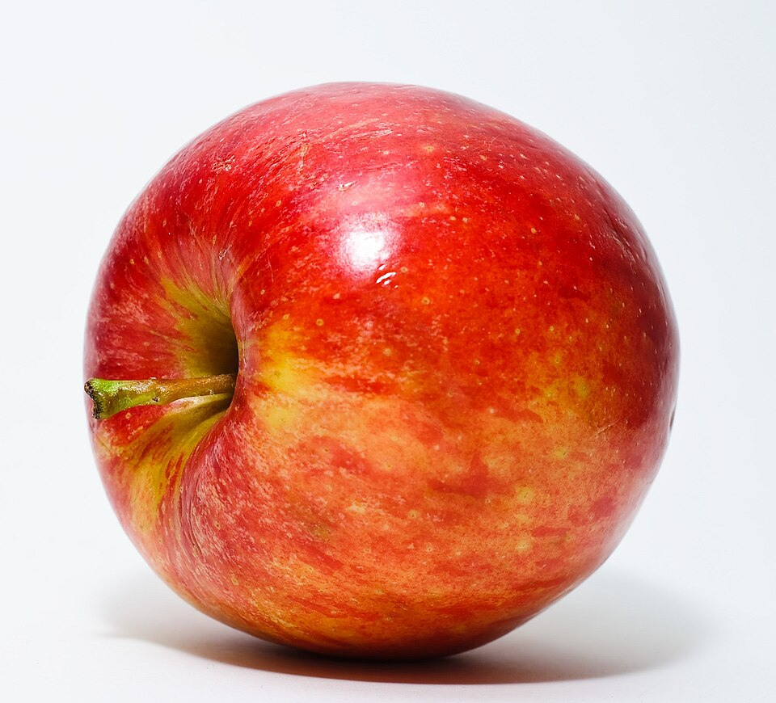
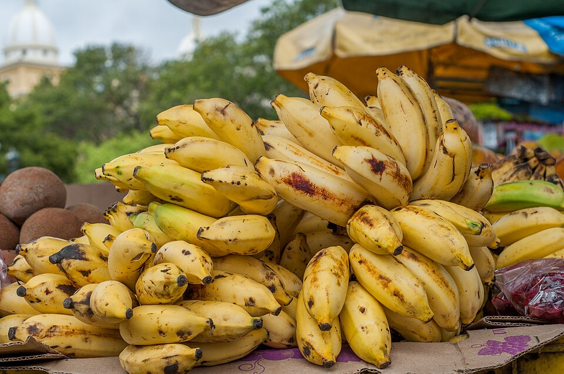
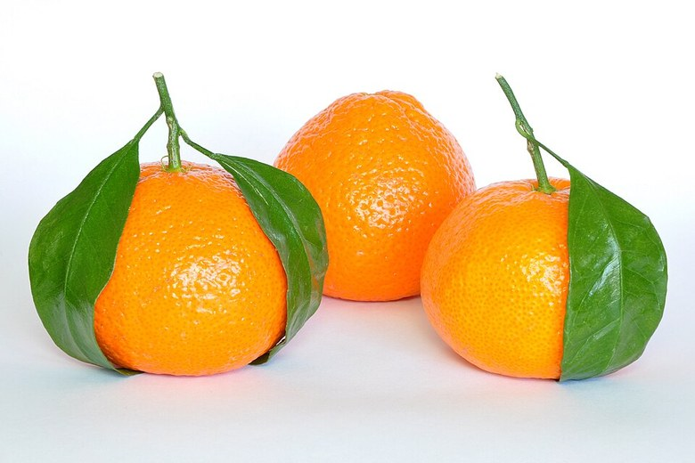

{/* _class: impact */}

# Fruit

SLOP1640 — week 9

Marisol Quaye

---

## Where this week sits

Week 2 sorted produce into ethylene producers and ethylene-sensitive
produce, and stored them apart on that basis. This week returns to the same
chemistry from the other side: most of the fruit responsible for that
ethylene, examined for what it is doing and when.

- the split this week teaches decides when a fruit is bought, not just
  where it is kept
- nothing here is a cooking technique — fruit is selected, stored and
  scheduled, not heated

---

{/* _class: banner */}

# Varieties and what distinguishes them

---

## Two ripening behaviours, not species

Fruit divides into two ripening behaviours, and that difference matters
more than the difference between any two species.

**Climacteric** fruit keeps producing ethylene and respiring faster after
it is picked, which is why it continues to ripen off the plant:

- apples
- bananas
- avocados
- peaches

---

## The other half

**Non-climacteric** fruit does not get that second wind. Once picked, it is
as ripe as it will ever be.

- citrus
- grapes
- cherries
- berries

A non-climacteric fruit picked underripe stays underripe. There is no later
stage to wait for.

---

{/* _class: banner */}

# Storage: where, and why

---

## Counter only

Refrigeration slows or blocks the ripening these fruits still have left to
do, so cold harms rather than helps them:

- bananas
- citrus
- mangoes
- melons
- papaya
- pineapple

---

## Counter first, then refrigerator

Stone fruit, kiwi and avocado ripen on the counter first. Once ripe, they
move to the refrigerator to hold that point rather than continue past it.

- the counter stage is not optional — it is where the ripening actually
  happens
- moving one of these to the fridge too early is the same mistake as the
  counter-only fruits, just reversed in timing

---

## Refrigerator from the start

Berries, cherries and grapes are non-climacteric and were as good as they
will ever get at harvest. Refrigeration from the start only slows their
decline — it cannot improve them.

---

## The link back to week 2

The climacteric/non-climacteric split, not the species, is what decided
where an ethylene producer went in week 2's refrigerator. The same
chemistry, examined here from the growing side rather than the storage
side, is one subject wearing two weeks.

---

{/* _class: banner */}

# Choosing well at the market

---

## Ripeness is read fruit by fruit

There is no single rule for ripeness at the point of sale.

- **apple** — firm and unbruised
- **citrus** — fragrant, and heavy for its size
- **avocado, papaya** — yielding to gentle pressure

A rule that worked for one of these would be wrong for another, which is
why this is read case by case rather than by instinct trained on a single
fruit.

---

{/* _class: banner */}

# Ripening as a schedulable process

---

## Buying underripe is a decision, not a compromise

Because a climacteric fruit keeps producing the hormone that ripens it
after harvest, buying one underripe is a way of deciding, rather than
discovering, when it will be ready.

- an underripe avocado bought four days before it is needed is a
  scheduling choice
- the same avocado bought ripe and eaten four days later has already
  passed its point

---

## Non-climacteric offers no such choice

A non-climacteric fruit must be bought at the ripeness it will be eaten at,
because none is coming later. There is no schedule to set — only a
point-of-sale judgement to get right the first time.

---

{/* _class: banner */}

# Nutrition: fat, protein and calories per 100 g

---

## Why this week carries a number

The invent-a-recipe assessment (week 6) asks for a nutritional composition
traceable to a named food-composition database. Fruit is a common
component of that composition and earns the same treatment this course has
already given vegetables and meat.

Figures below are per 100 g raw, from USDA FoodData Central, for the five
fruits this week's tutorial exercise draws on: the climacteric fruits here
— apple, banana, mango — and the two non-climacteric fruits — orange and
strawberry.

---

## Apple, banana, orange, strawberry, mango

| Fruit | Calories (kcal) | Fat (g) | Protein (g) | FDC ID |
|---|---|---|---|---|
| Apple, raw, with skin | 52 | 0.17 | 0.26 | 171688 |
| Banana, raw | 89 | 0.33 | 1.09 | 173944 |
| Orange, raw | 47 | 0.12 | 0.94 | 169097 |
| Strawberries, raw | 32 | 0.30 | 0.67 | 167762 |
| Mangos, raw | 60 | 0.38 | 0.82 | 169910 |

---

## Reading the spread

The calorie spread across the five tracks sugar content more than anything
else discussed this week. None of the five is a meaningful source of fat
or protein — worth stating so a recipe's protein total is not accidentally
attributed to its fruit component.

This week's tutorial exercise uses the macro calculator on all five of
these figures, drawn directly from FoodData Central.

---

{/* _class: quote */}

> A non-climacteric fruit does not wait for you. A climacteric one will,
> for exactly as long as you plan for it to.
>
> — Marisol Quaye

---

{/* _class: centered */}

## Reading

University of Maryland Extension, ["Ethylene and the Regulation of Fruit
Ripening"](https://extension.umd.edu/resource/ethylene-and-regulation-fruit-ripening)

NDSU Agriculture Extension, ["Focus on Whole Fruits: How to Select and
Store Fruit"](https://www.ndsu.edu/agriculture/extension/publications/focus-whole-fruits-how-select-and-store-fruit)

University of Wyoming Extension, ["Storing Fruits and Veggies So They Last
Longer"](https://uwyoextension.org/uwnutrition/newsletters/storing-fruits-and-veggies-so-they-last-longer/)

USDA [FoodData Central](https://fdc.nal.usda.gov/) — apple, banana,
orange, strawberry and mango entries cited above.

Next: week 10 pulls the storage material from this week and weeks 2, 3 and
4 into a single account, before the course starts cooking.
