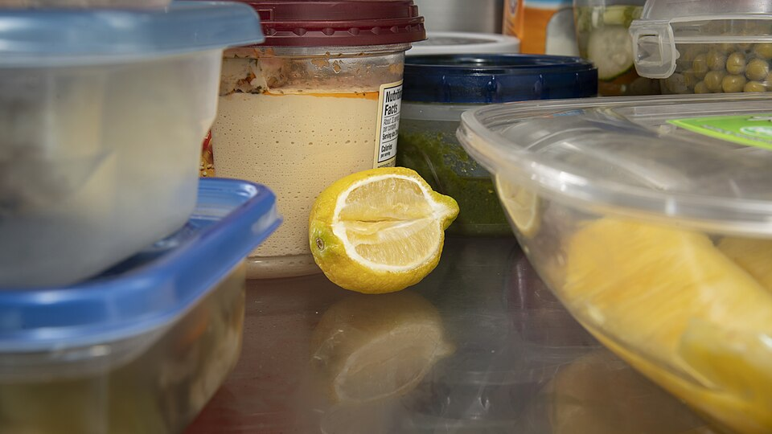
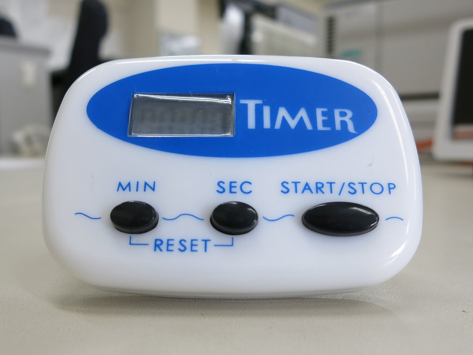
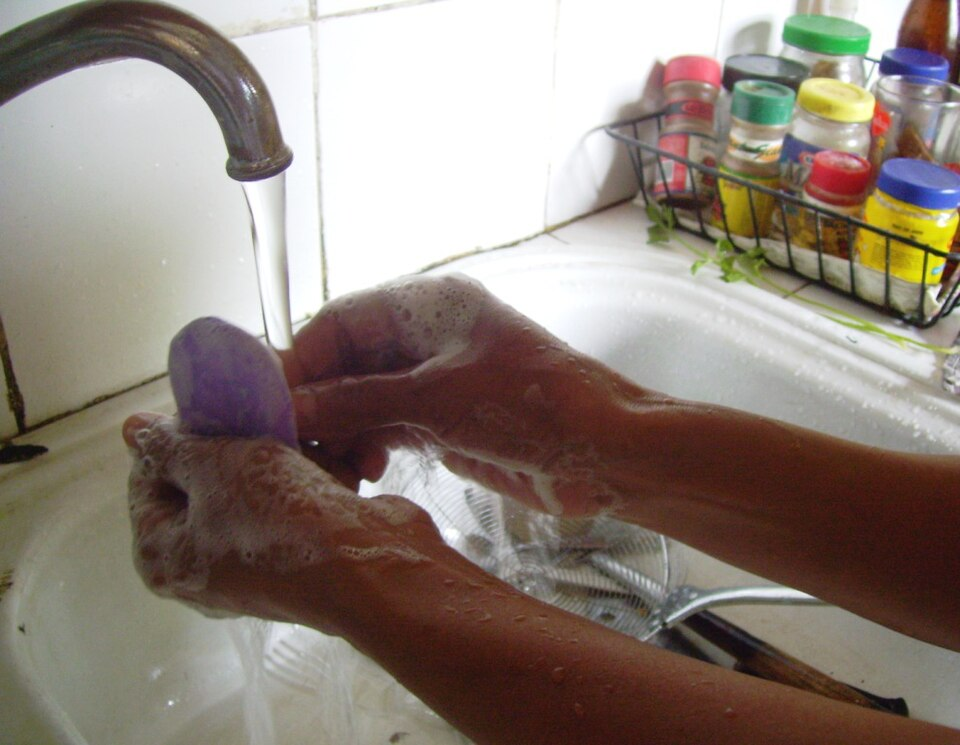
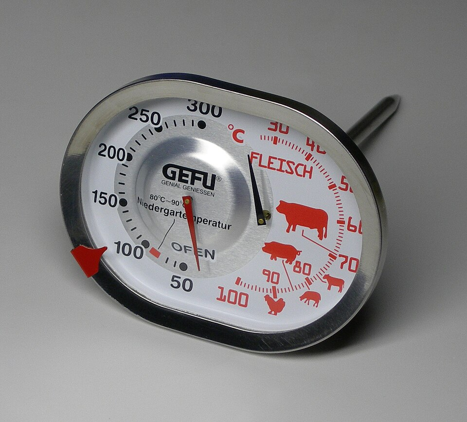

{/* _class: impact */}

# Food safety and the cold chain

SLOP1640 — week 10

Marisol Quaye

---

## Why this week is different

Every week since week 2 has stored something: a vegetable, a bird, a fish,
a cut of beef or lamb, a piece of fruit. This week does not add a new
material.

- it takes the storage logic scattered across weeks 2, 3, 4 and 9 and
  states it once, as a single account
- it is the last week before the course does anything that requires that
  account to have already been understood

---

{/* _class: banner */}

# The danger zone

---

## The range, and how fast it works

Foodborne bacteria multiply fastest between 4 °C and 60 °C (40 °F to
140 °F) — the range USDA's Food Safety and Inspection Service names,
plainly, the danger zone.

- inside the middle of that band, some common bacteria can double in
  number in as little as twenty minutes
- this is not a new rule; it is the rule week 3 already applied to poultry
  and fish, restated as the general case it always was

<svg viewBox="0 0 900 150" width="900" style="max-width: 100%; height: auto; max-height: 220px; display: inline-block;" role="img" aria-label="Temperature scale from 0 to 100 degrees Celsius, with the 4 to 60 degree danger zone highlighted in the middle">
  <line x1="40" y1="70" x2="860" y2="70" stroke="currentColor" stroke-width="2" />
  <rect x="72.8" y="50" width="459.2" height="40" fill="rgba(220,80,60,0.35)" stroke="currentColor" stroke-width="1.5" />
  <text x="302.4" y="45" font-size="18" text-anchor="middle" fill="currentColor">Danger zone: 4 &#8451; to 60 &#8451;</text>
  <line x1="40" y1="62" x2="40" y2="78" stroke="currentColor" stroke-width="2" />
  <text x="40" y="105" font-size="16" text-anchor="middle" fill="currentColor">0 &#8451;</text>
  <line x1="72.8" y1="62" x2="72.8" y2="78" stroke="currentColor" stroke-width="2" />
  <text x="72.8" y="125" font-size="16" text-anchor="middle" fill="currentColor">4 &#8451;</text>
  <line x1="532" y1="62" x2="532" y2="78" stroke="currentColor" stroke-width="2" />
  <text x="532" y="125" font-size="16" text-anchor="middle" fill="currentColor">60 &#8451;</text>
  <line x1="860" y1="62" x2="860" y2="78" stroke="currentColor" stroke-width="2" />
  <text x="860" y="105" font-size="16" text-anchor="middle" fill="currentColor">100 &#8451;</text>
</svg>

---

## The two-hour rule

Perishable material must be refrigerated within two hours of leaving a
controlled temperature — or within one hour if the surrounding air is
above 32 °C.

The clock starts the moment the material leaves refrigeration, cooking, or
the shop's own cold chain — not when it is next convenient to deal with
it.

---

## Worked example

A tray of raw chicken thighs sits on a bench at 24 °C for ninety minutes
before someone remembers it. Ninety minutes is inside the two-hour limit,
so the tray is still safe to refrigerate — but only just, and only because
the room was not above 32 °C. The same tray left for two and a half hours
must be discarded, not smelled and judged.

---

{/* _class: banner */}

# Cross-contamination

---

## The four-step framework

The same organisms that make raw poultry, fish and meat perishable
transfer to whatever a knife or a board touches next. The public-health
framework behind this is stated in four steps:

**clean → separate → cook → chill**

This week closes out three of them.

---

## What this week covers, and what it doesn't

- **clean and separate** — the boards, knives and hands kept apart between
  raw material and anything eaten as-is
- **chill** — the refrigeration clock already described
- **cook** — the fourth step, is next week's subject, not this one's

---

{/* _class: banner */}

# How long prepared material keeps

---

## Poultry, fish and red meat

Once refrigerated at or below 4 °C:

| Material | Refrigerated holding time |
|---|---|
| Raw poultry, raw ground meats | 1–2 days |
| Raw steaks, chops, roasts | 3–5 days |

These are the same figures week 3 and week 4 gave for their respective
materials, gathered here rather than repeated.

Whether the reading being checked is a refrigerator's or a roast's, the
number on a dial is a claim to verify, not to trust — the same point week 3
made with an appliance thermometer left on a shelf holds equally for a
probe read directly from the food.

---

## Vegetables carry the same clock, differently

Week 2 did not give vegetables a single holding-time figure, because the
question there was which shelf and which humidity, not how many days. The
same cold-chain principle still applies: an ethylene-sensitive vegetable
stored correctly keeps longer not because it is a different kind of
material, but because its clock was started correctly, at the right
temperature, from the beginning.

---

## Fruit is different

Cut and ripening fruit from week 9 sits on a shorter, less uniform clock —
set by ripeness rather than by a fixed rule. Of the material named this
week, fruit is the one that keeps shortest and the one a fixed number is
least able to describe on its own.

---

{/* _class: banner */}

# Why this sits here

---

## One argument, not four pieces of advice

Weeks 2, 3, 4 and 9 each taught a storage rule for one kind of material.
Read on their own, they look like four unrelated pieces of advice.

Read together, they are one argument: a kitchen's preparation work is only
as good as its coldest link, and the material this course has spent nine
weeks handling has been on that clock the whole time, whether or not it
was named.

---

{/* _class: banner */}

# This week's tutorial

---

## The storage-duration calculator

This week's exercise takes a prep date and time plus an ingredient or dish
type, and returns a safe-until date and time — the danger-zone and
holding-time rules on this slide, applied to a specific case rather than
read as a general figure.

- the same USDA FSIS cold-chain guidance cited on this slide feeds the
  calculator's data
- an answer that looks close to right and an answer that is right are not
  the same thing when the margin is measured in hours

---

{/* _class: quote */}

> A kitchen's preparation work is only as good as its coldest link.
>
> — Marisol Quaye

---

{/* _class: centered */}

## Reading

USDA FSIS, ["'Danger Zone' (40°F -
140°F)"](https://www.fsis.usda.gov/food-safety/safe-food-handling-and-preparation/food-safety-basics/danger-zone-40f-140f)

FoodSafety.gov, ["4 Steps to Food
Safety"](https://www.foodsafety.gov/keep-food-safe/4-steps-to-food-safety)

USDA FSIS, ["Refrigeration and Food
Safety"](https://www.fsis.usda.gov/food-safety/safe-food-handling-and-preparation/food-safety-basics/refrigeration)

Next: week 11 is the first week this course applies heat — and applies it
only to test whether the preparation this account describes actually
decided the result.
