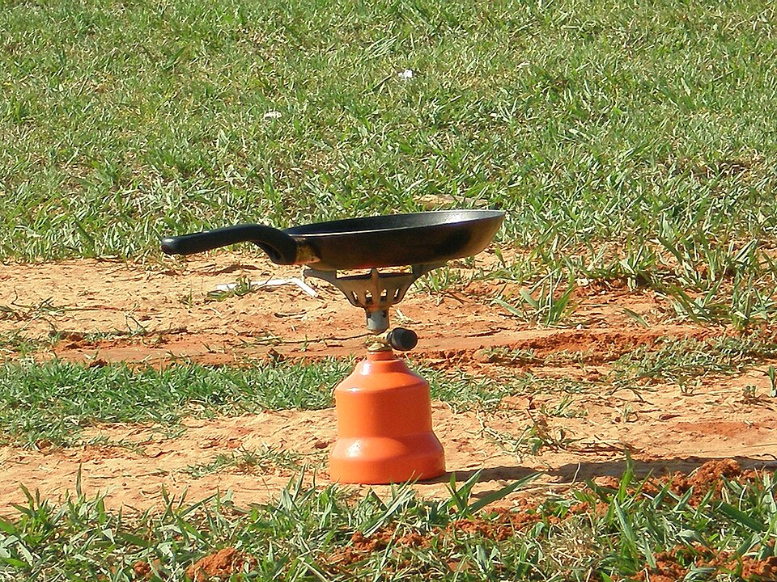

{/* _class: impact */}

# Cooking

SLOP1640 — week 11

Marisol Quaye and Idris Fenn

---

## The first week that uses heat

Ten weeks of this course have been preparation without heat. This week is
the first to use it — and it uses it as an instrument, not as the subject.

- the question being tested is whether preparation, not technique,
  decides the result
- heat is covered only as far as this comparison needs

---

{/* _class: banner */}

# The design

---

## Two batches, one stated variable

Each pair or small group is given two batches of the same raw material,
prepared two different ways upstream:

- one batch follows the standards this course has taught since week 2 —
  correct storage temperature, a clean cut from week 7's grip and edge
  work, correct cold-chain handling from week 10
- the other batch deliberately departs from one of those standards, in a
  single, stated way

---

## Everything else held identical

Everything downstream of that one difference is held identical:

- same recipe
- same heat method
- same time
- same person cooking both batches

If the two dishes differ, the difference has to be attributable to the
one variable that was not held constant.

---

## What the variable can be

The deviation is chosen from what the course has already taught, not
invented for the exercise:

- storage temperature held above 4 °C instead of at or below it
- a cut made across the grain instead of with the anatomy, from week 7
- cold-chain handling that skipped the two-hour rule from week 10

One variable, stated in advance, so the comparison has something specific
to trace a result back to.

---

{/* _class: banner */}

# Doneness is checked, not guessed

---

## The thermometer decides

A thermometer decides when a batch is done, against the same minimum
internal temperatures used throughout the course's storage material:

| Material | Minimum internal temperature |
|---|---|
| Whole cut — beef, pork, lamb, veal | approx. 63 °C |
| Poultry | 74 °C |
| Ground meat | higher than either, sourced |

---

## Why colour and time are not reliable

Grinding distributes any surface bacteria through the whole piece rather
than leaving it on a surface a sear can reach — which is why ground meat's
minimum sits higher than a whole cut's.

Colour and time are both unreliable across the two batches in this
exercise for the same reason they are unreliable generally: they describe
the outside of the food, and this week's variable often is not on the
outside.

---

{/* _class: banner */}

# What is compared

---

## Same terms, narrower question

The two finished dishes are compared on the same terms an earlier
assignment already predicted a dish on — colour, aroma, flavour, texture —
but the question here is narrower.

- which of those differences, if any, can be traced to the stated
  preparation difference, rather than to anything that happened after the
  pan was hot
- a group that finds no difference has also learned something, provided
  they can say which preparation variable they tested and why it turned
  out not to matter this time

---

## Recording the result

Each pair states its result in the same form: the variable tested, what
was held identical, and which of colour, aroma, flavour or texture
differed, if any. A result that cannot be stated this way is not yet a
result — it is an impression of two dishes that happened to taste
different.

---

{/* _class: banner */}

# Afterwards

---

## This is the first check, not the last

This is the first week the course's central claim is checked against an
actual result rather than argued from storage temperatures and figures.

Week 12 checks it again, once, under conditions this session does not
have: a stated time limit and an audience.

---

{/* _class: quote */}

> A group that finds no difference has also learned something, provided
> they can say which preparation variable they tested and why it turned
> out not to matter this time.
>
> — Idris Fenn

---

{/* _class: centered */}

## Reading

USDA FSIS, ["Safe Minimum Internal Temperature
Chart"](https://www.fsis.usda.gov/food-safety/safe-food-handling-and-preparation/food-safety-basics/safe-temperature-chart)

USDA, ["Cooking Meat: Is It Done
Yet?"](https://www.usda.gov/about-usda/news/blog/cooking-meat-it-done-yet)

No tutorial exercise this week — the exercise is the comparison itself.
Next: week 12 runs the same test once, live, for a mark.
