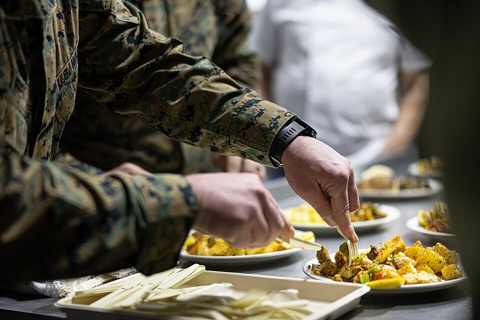
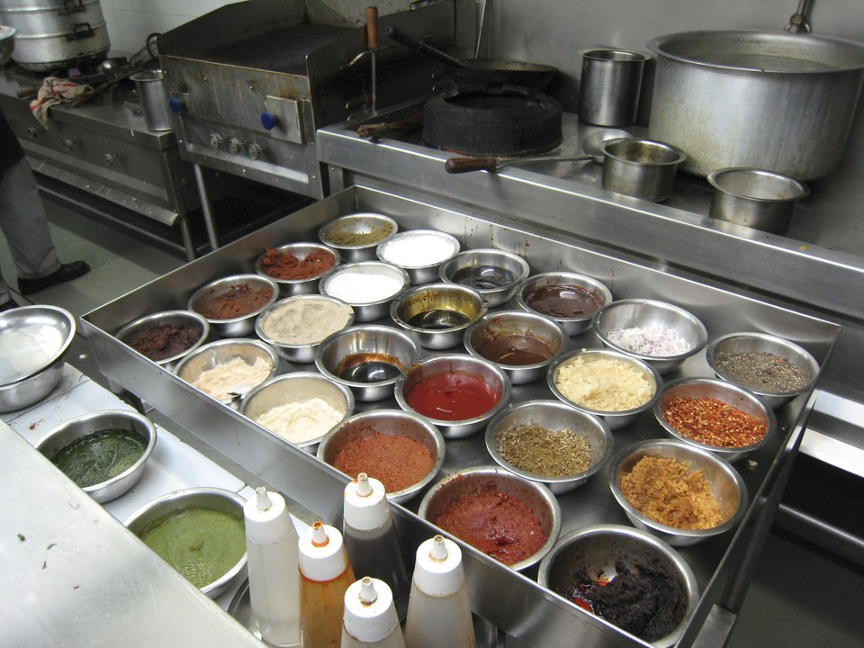
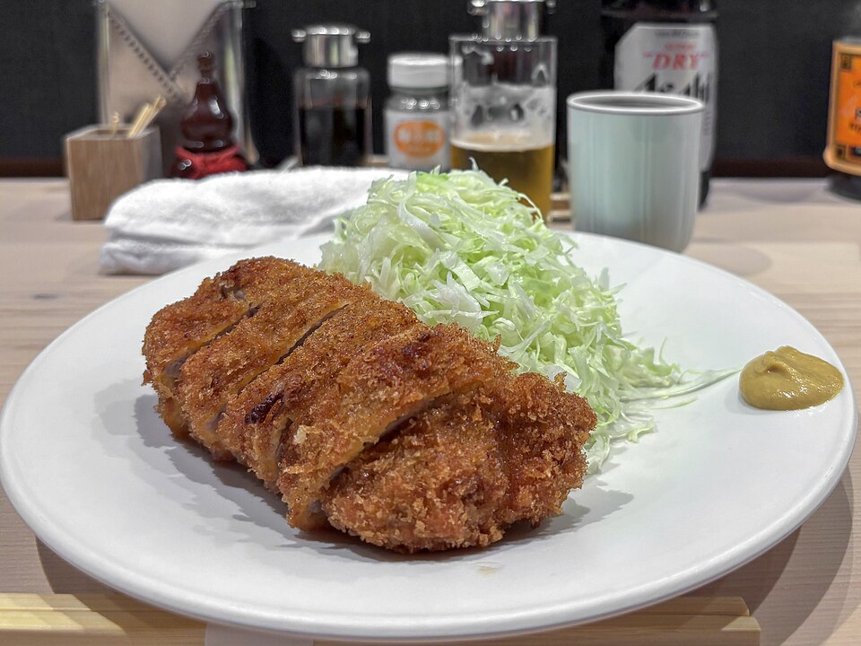
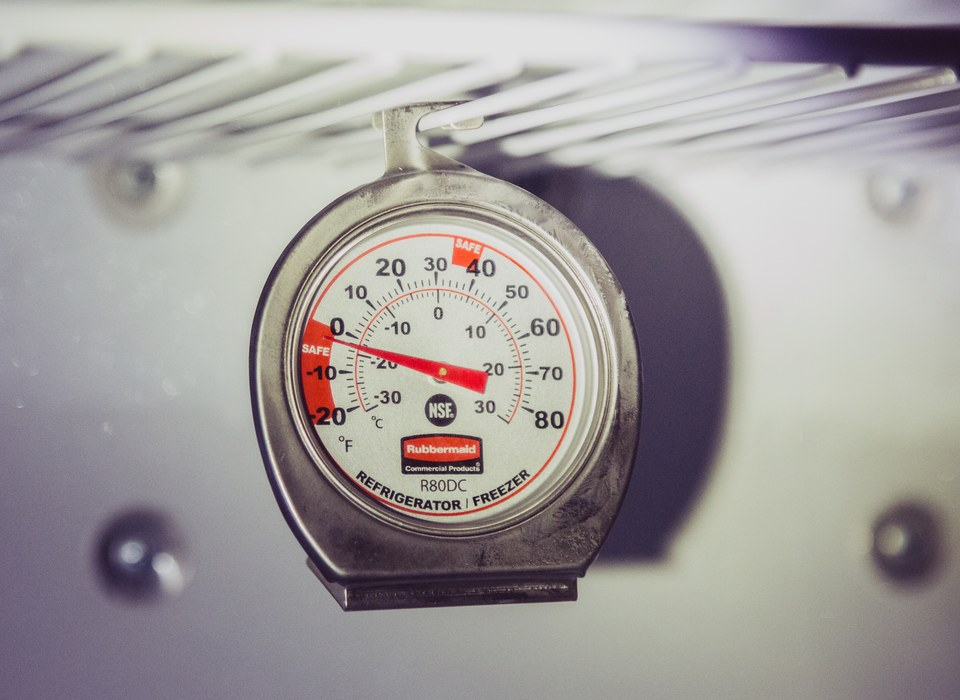
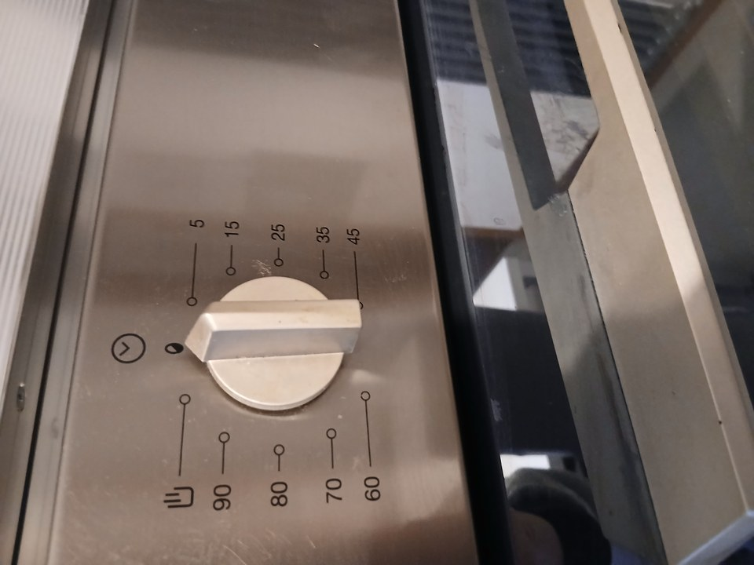

{/* _class: impact */}

# Live test — the public kitchen

SLOP1640 — week 12

Marisol Quaye and Idris Fenn

---

## The test, repeated once, live

Week 11 tested the course's thesis under controlled conditions, one
variable at a time, with no one watching but the group itself.

Week 12 repeats the test once, live, for a mark: the assessed practical
this course calls the public kitchen.

---

{/* _class: banner */}

# What is examined

---

## Preparation, not the plate in isolation

The examination is of the preparation: what was decided before the
heat — selection, storage, the cut, the order ingredients were staged in —
and whether that sequence held up once a stated time limit and an
audience were added to it.

---

## Right for the wrong reason, wrong for a good one

A finished dish can look right and still have arrived there by an
unrepeatable accident. A dish can look wrong and still have been prepared
correctly, with the difference explainable.

This week's assessment is built to separate the two, rather than mark on
appearance alone.

---

## How the examination reads the plate

A marker asking whether the preparation held up is not asking whether the
dish is edible. They are tracing specific decisions forward: was the cut
consistent, was the material held at temperature, was the sequence staged
so nothing sat too long before its turn. The plate is evidence for those
decisions, not the thing being judged on its own terms.

---

{/* _class: banner */}

# The one new condition

---

## What week 11 could not test

Week 11 removed every variable except one stated preparation difference.
Week 12 adds back a condition no earlier week could test under laboratory
control:

- a fixed time allowance
- people watching

---

## The standards do not change

Nothing about the preparation standards changes — the same cold-chain
handling, the same cut quality, the same storage decisions this course
has taught since week 2 — but they are now performed once, without a
rehearsal to fall back on.

---

## Why a clock and an audience are a real test

A group in week 11 could pause, check a step, or start over if something
went wrong early. The public kitchen removes that option: a decision made
badly at minute five is still on the plate at the end, because there is no
second attempt inside the time allowed.

---

{/* _class: banner */}

# Correspondence with the written account

---

## What week 6 predicted

The invent-a-recipe assignment, submitted in week 6, predicted a dish
before it existed:

- a preparation process
- a nutritional composition
- a sensory description

Week 12 is where that prediction is tested against an actual result.

<svg viewBox="0 0 860 150" width="1180" style="max-width: 100%; height: auto; max-height: 130px; display: inline-block;" role="img" aria-label="Diagram showing the three parts of the week 6 written prediction, preparation process, nutritional composition and sensory description, each checked against its corresponding part of the week 12 plated result">
  <defs>
    <marker id="w12-corr-arrow" markerWidth="8" markerHeight="8" refX="6" refY="4" orient="auto">
      <path d="M0,0 L8,4 L0,8 Z" fill="currentColor" />
    </marker>
  </defs>
  <rect x="10" y="5" width="280" height="38" rx="6" fill="rgba(255,255,255,0.06)" stroke="currentColor" stroke-width="1.5" />
  <text x="150" y="28" font-size="12" text-anchor="middle" fill="currentColor">Preparation process</text>
  <rect x="10" y="56" width="280" height="38" rx="6" fill="rgba(255,255,255,0.06)" stroke="currentColor" stroke-width="1.5" />
  <text x="150" y="79" font-size="12" text-anchor="middle" fill="currentColor">Nutritional composition</text>
  <rect x="10" y="107" width="280" height="38" rx="6" fill="rgba(255,255,255,0.06)" stroke="currentColor" stroke-width="1.5" />
  <text x="150" y="130" font-size="12" text-anchor="middle" fill="currentColor">Sensory description</text>
  <rect x="570" y="5" width="280" height="38" rx="6" fill="rgba(255,255,255,0.06)" stroke="currentColor" stroke-width="1.5" />
  <text x="710" y="28" font-size="12" text-anchor="middle" fill="currentColor">Same process, on the plate</text>
  <rect x="570" y="56" width="280" height="38" rx="6" fill="rgba(255,255,255,0.06)" stroke="currentColor" stroke-width="1.5" />
  <text x="710" y="79" font-size="12" text-anchor="middle" fill="currentColor">Same composition, measured</text>
  <rect x="570" y="107" width="280" height="38" rx="6" fill="rgba(255,255,255,0.06)" stroke="currentColor" stroke-width="1.5" />
  <text x="710" y="130" font-size="12" text-anchor="middle" fill="currentColor">Same description, tasted</text>
  <line x1="295" y1="24" x2="565" y2="24" stroke="currentColor" stroke-width="2" marker-end="url(#w12-corr-arrow)" />
  <line x1="295" y1="75" x2="565" y2="75" stroke="currentColor" stroke-width="2" marker-end="url(#w12-corr-arrow)" />
  <line x1="295" y1="126" x2="565" y2="126" stroke="currentColor" stroke-width="2" marker-end="url(#w12-corr-arrow)" />
</svg>

---

## What counts as demonstrating the course

A student who can point to a specific preparation decision from their own
account and show where it shows up in the finished plate has demonstrated
the thing this course has argued for all semester.

A student who cannot has produced a dish, but not yet the argument this
course is built to teach.

---

{/* _class: banner */}

# Afterwards

---

## The last teaching week

This is the last teaching week. What is assessed here does not introduce
a new preparation idea — it is the same case made in weeks 1 through 11,
run once under conditions that cannot be repeated if the first attempt
goes wrong.

---

{/* _class: quote */}

> The examination is of the preparation, not the plate in isolation.
>
> — Marisol Quaye

---

{/* _class: centered */}

## Closing

No tutorial exercise this week — the live test is itself the exercise.

Twelve weeks began with the claim that a meal is decided before it is
cooked. This is where that claim was checked.
